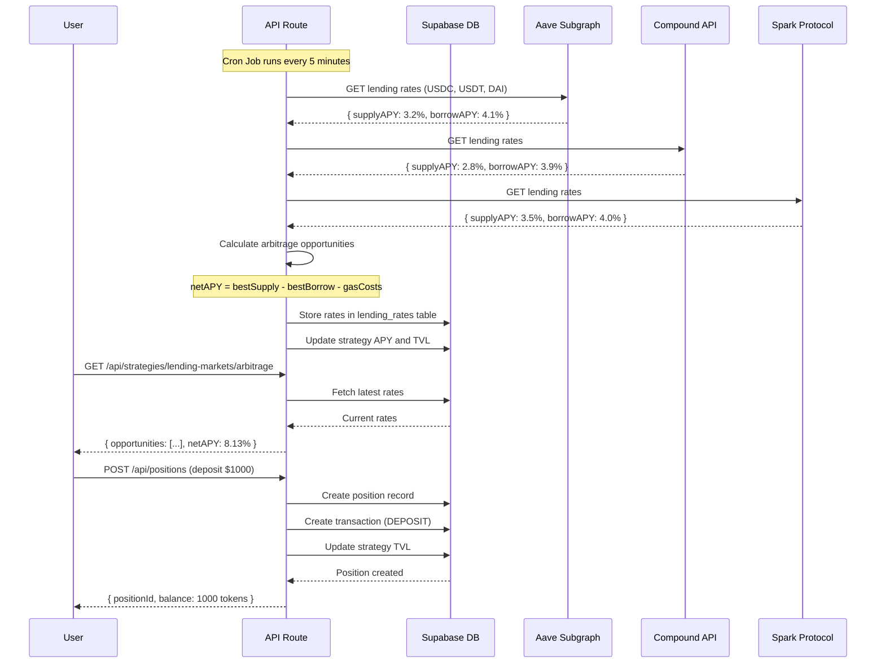
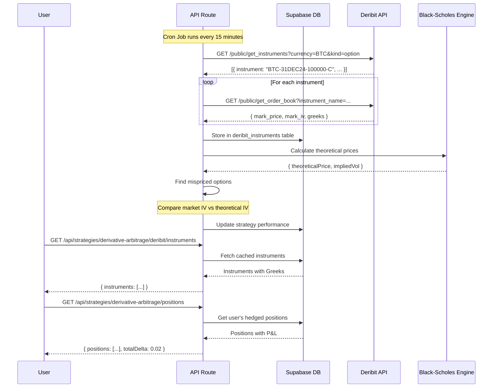
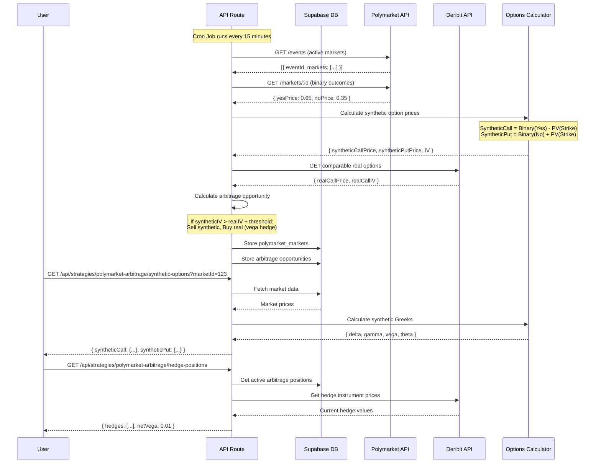
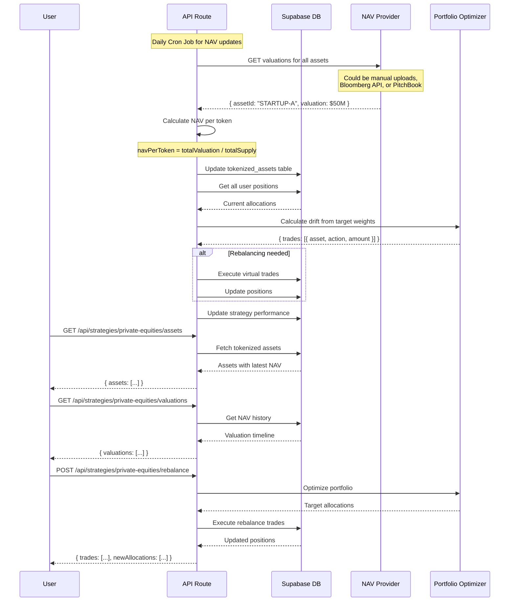
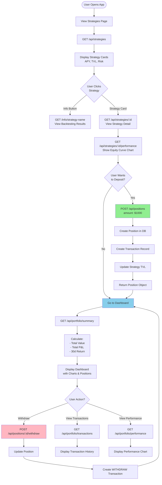
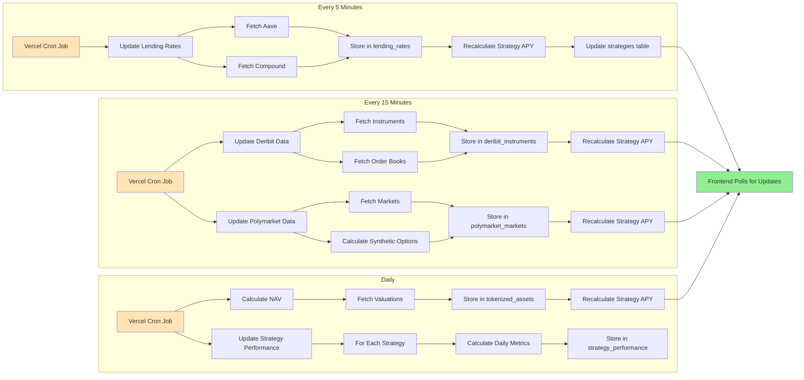
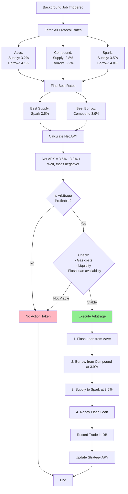
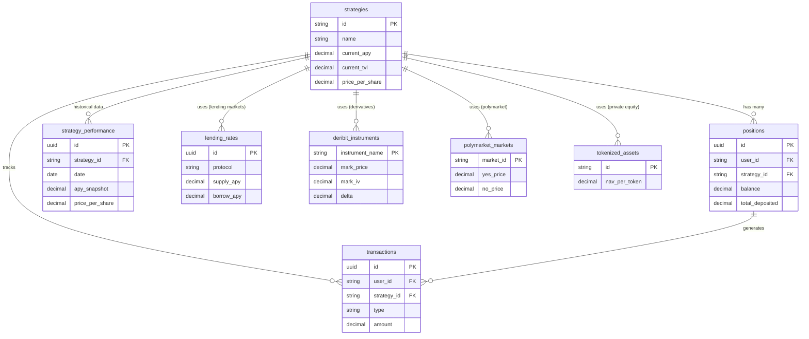
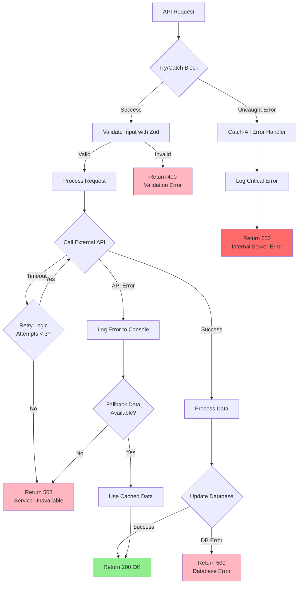

# Strategy Flow Diagrams

Diagramas de flujo detallados de cada estrategia y sus interacciones con APIs externas.

---

## 1. Lending Markets Strategy Flow



---

## 2. Derivative Arbitrage Strategy Flow (Deribit)



---

## 3. Polymarket Arbitrage Strategy Flow



---

## 4. Private Equities Strategy Flow



---

## 5. User Portfolio Flow (General)



---

## 6. Background Jobs Flow



---

## 7. Lending Markets Arbitrage Execution Flow



---

## 8. Polymarket Synthetic Option Calculation

```mermaid
flowchart TD
    Start[Polymarket Market Data] --> GetPrices[Yes Price: 0.65<br/>No Price: 0.35]

    GetPrices --> GetExpiry[Event End Date:<br/>31-DEC-2024]

    GetExpiry --> CalcDays[Days to Expiry:<br/>45 days]

    CalcDays --> CalcDiscount[Calculate Discount Factor:<br/>df = e^(-0.05 * 45/365)]

    CalcDiscount --> PVStrike[PV of Strike:<br/>Assume K = $50,000<br/>PV = 50000 * df]

    PVStrike --> SynthCall[Synthetic Call Price =<br/>Yes_Price - PV_Strike_Normalized]

    PVStrike --> SynthPut[Synthetic Put Price =<br/>No_Price + PV_Strike_Normalized]

    SynthCall --> CallPrice[Call Price: $0.42]
    SynthPut --> PutPrice[Put Price: $0.58]

    CallPrice --> CalcIV[Calculate Implied Volatility<br/>Using Black-Scholes]
    PutPrice --> CalcIV

    CalcIV --> Newton[Newton-Raphson Method:<br/>Find σ where BS(σ) = Market Price]

    Newton --> IV[Implied Vol: 45%]

    IV --> CompareReal{Compare to<br/>Real Options<br/>on Deribit}

    CompareReal --> DeribitIV[Deribit IV: 35%]

    DeribitIV --> ArbCheck{Polymarket IV<br/>> Deribit IV?}

    ArbCheck -->|Yes| Opportunity[Arbitrage Opportunity!<br/>Sell Polymarket (expensive)<br/>Buy Deribit (cheap)]

    ArbCheck -->|No| NoArb[No Arbitrage]

    Opportunity --> CalcHedge[Calculate Vega Hedge:<br/>hedge_ratio = vega_poly / vega_deribit]

    CalcHedge --> StoreOpp[Store Opportunity in DB]

    NoArb --> End[End]
    StoreOpp --> End

    style Opportunity fill:#90EE90
    style NoArb fill:#FFB6C1
```

---

## 9. Database Update Flow



---

## 10. Error Handling Flow



---

**Last Updated**: 2025-11-30
