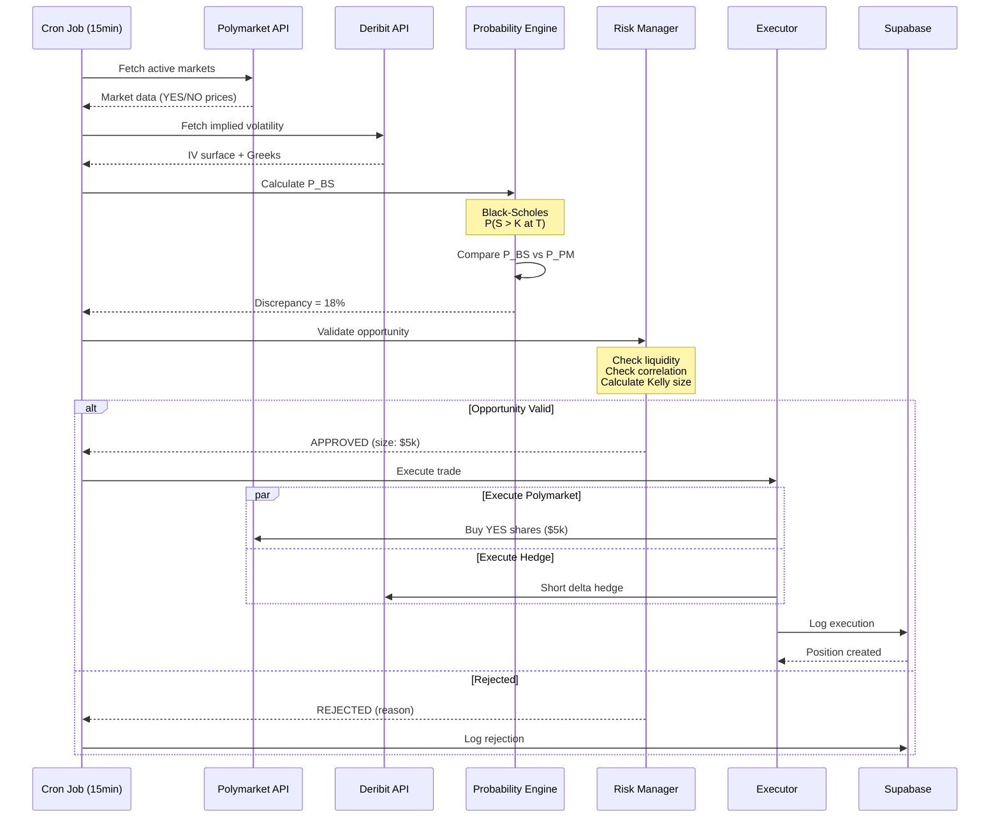

# Black-Scholes vs Polymarket Arbitrage System
## Technical Specification & Implementation Guide

**Version:** 1.0
**Status:** Design Phase
**Target Launch:** December 1, 2025
**Strategy Type:** Statistical Arbitrage (Model-Based)

---

## Executive Summary

This specification defines a quantitative trading system that identifies and exploits probability discrepancies between:
- **Theoretical probabilities** derived from Black-Scholes option pricing model
- **Implied probabilities** observed in Polymarket prediction markets

The system will be built in three phases:
1. **MVP (Months 1-2):** Core probability calculation and manual validation
2. **Model Enhancement (Months 3-4):** Ensemble models and automated execution
3. **Production Hardening (Months 5-6):** Scale, optimization, and institutional readiness

**Key Constraints:**
- Only execute when probability discrepancy > 15% (minimum viable spread)
- Delta-neutral positioning via Deribit hedges
- Vega exposure actively managed
- Position sizing based on Kelly Criterion (fractional)
- Maximum capital deployment: $100k (Phase 1), scaling to $500k+ (Phase 3)

**Expected Performance (Post-Validation):**
- Win Rate: 60%+ (per OKRs)
- ROI per Trade: 5-12% (after costs)
- Sharpe Ratio: >2.0
- Max Drawdown: <15%

---

## Table of Contents

1. [System Architecture](#system-architecture)
2. [Phase 1: MVP Specification](#phase-1-mvp-specification)
3. [Phase 2: Model Enhancement](#phase-2-model-enhancement)
4. [Phase 3: Production Hardening](#phase-3-production-hardening)
5. [Technical Stack](#technical-stack)
6. [Data Models](#data-models)
7. [API Specifications](#api-specifications)
8. [Risk Management](#risk-management)
9. [Testing Strategy](#testing-strategy)
10. [Deployment Plan](#deployment-plan)

---

## System Architecture

### High-Level Overview

```
┌─────────────────────────────────────────────────────────────────┐
│                      Data Ingestion Layer                        │
├─────────────────────────────────────────────────────────────────┤
│                                                                  │
│  Polymarket API ──┐                                             │
│                   ├──> Event Normalizer ──> Supabase Cache      │
│  Deribit API ─────┤                                             │
│                   │                                              │
│  Price Feeds ─────┘                                             │
│  (Spot, IV, Rates)                                              │
└─────────────────────────────────────────────────────────────────┘
                              │
                              ▼
┌─────────────────────────────────────────────────────────────────┐
│                    Probability Engine Layer                      │
├─────────────────────────────────────────────────────────────────┤
│                                                                  │
│  Black-Scholes Calculator                                       │
│  GARCH Volatility Model (Phase 2)                               │
│  Monte Carlo Simulator (Phase 2)                                │
│  Ensemble Aggregator (Phase 2)                                  │
│                                                                  │
└─────────────────────────────────────────────────────────────────┘
                              │
                              ▼
┌─────────────────────────────────────────────────────────────────┐
│                  Opportunity Detection Layer                     │
├─────────────────────────────────────────────────────────────────┤
│                                                                  │
│  Probability Comparator                                         │
│  Confidence Scorer                                              │
│  Profitability Calculator                                       │
│  Signal Generator                                               │
│                                                                  │
└─────────────────────────────────────────────────────────────────┘
                              │
                              ▼
┌─────────────────────────────────────────────────────────────────┐
│                    Risk Management Layer                         │
├─────────────────────────────────────────────────────────────────┤
│                                                                  │
│  Position Sizer (Kelly Criterion)                               │
│  Correlation Validator                                          │
│  Liquidity Checker                                              │
│  Portfolio Risk Monitor                                         │
│  Circuit Breakers                                               │
│                                                                  │
└─────────────────────────────────────────────────────────────────┘
                              │
                              ▼
┌─────────────────────────────────────────────────────────────────┐
│                      Execution Layer                             │
├─────────────────────────────────────────────────────────────────┤
│                                                                  │
│  Polymarket Executor (CLOB API)                                 │
│  Deribit Hedge Manager                                          │
│  Transaction Coordinator (Atomic)                               │
│  Slippage Monitor                                               │
│                                                                  │
└─────────────────────────────────────────────────────────────────┘
                              │
                              ▼
┌─────────────────────────────────────────────────────────────────┐
│                   Position Management Layer                      │
├─────────────────────────────────────────────────────────────────┤
│                                                                  │
│  Delta Hedger (Dynamic Rebalancing)                             │
│  Gamma Monitor                                                  │
│  Vega Neutralizer                                               │
│  P&L Tracker                                                    │
│  Auto-Closer (Event Resolution)                                 │
│                                                                  │
└─────────────────────────────────────────────────────────────────┘
```

### Data Flow



---

## Phase 1: MVP Specification

**Duration:** 8 weeks
**Goal:** Validate the core thesis with minimal complexity

### Objectives

1. Build Black-Scholes probability calculator
2. Integrate Polymarket and Deribit data feeds
3. Detect opportunities with >15% discrepancy
4. Execute first manual trade with hedge
5. Validate model accuracy through paper trading

### Core Components

#### 1.1 Black-Scholes Probability Calculator

**Purpose:** Calculate risk-neutral probability that an asset price will exceed a strike at expiry.

**Mathematical Foundation:**

For a binary option with payoff = $1 if S_T > K, else $0:

```
P(S_T > K) = N(d2)

where:
d1 = [ln(S/K) + (r + σ²/2)T] / (σ√T)
d2 = d1 - σ√T

N(x) = Cumulative standard normal distribution
S = Spot price
K = Strike price
r = Risk-free rate
σ = Implied volatility
T = Time to expiry (years)
```

**Implementation:**

```typescript
// lib/models/black-scholes.ts

interface BSInputs {
  spotPrice: number      // Current asset price
  strikePrice: number    // Binary option strike
  timeToExpiry: number   // Days until expiry
  impliedVol: number     // Annualized IV (from Deribit)
  riskFreeRate: number   // From Aave USDC supply rate
}

interface BSOutputs {
  probability: number    // P(S > K at T)
  delta: number         // ∂P/∂S (for hedging)
  gamma: number         // ∂²P/∂S²
  vega: number          // ∂P/∂σ
  theta: number         // ∂P/∂T
}

export class BlackScholesEngine {

  /**
   * Calculate probability of binary option finishing ITM
   */
  calculateProbability(inputs: BSInputs): BSOutputs {
    const { spotPrice: S, strikePrice: K, timeToExpiry, impliedVol, riskFreeRate: r } = inputs

    // Convert days to years
    const T = timeToExpiry / 365
    const σ = impliedVol

    // Handle edge cases
    if (T <= 0) {
      return {
        probability: S > K ? 1 : 0,
        delta: 0,
        gamma: 0,
        vega: 0,
        theta: 0
      }
    }

    if (σ <= 0) {
      throw new Error('Implied volatility must be positive')
    }

    // Calculate d1 and d2
    const d1 = (Math.log(S / K) + (r + 0.5 * σ ** 2) * T) / (σ * Math.sqrt(T))
    const d2 = d1 - σ * Math.sqrt(T)

    // Calculate probability (N(d2))
    const probability = this.normalCDF(d2)

    // Calculate Greeks
    const delta = this.normalPDF(d2) / (S * σ * Math.sqrt(T))
    const gamma = this.normalPDF(d2) / (S ** 2 * σ ** 2 * T)
    const vega = S * this.normalPDF(d1) * Math.sqrt(T) / 100  // Per 1% vol change
    const theta = -(S * this.normalPDF(d1) * σ) / (2 * Math.sqrt(T)) / 365  // Per day

    return {
      probability,
      delta,
      gamma,
      vega,
      theta
    }
  }

  /**
   * Cumulative standard normal distribution
   */
  private normalCDF(x: number): number {
    // Approximation (Abramowitz and Stegun)
    const t = 1 / (1 + 0.2316419 * Math.abs(x))
    const d = 0.3989423 * Math.exp(-x * x / 2)
    const probability = d * t * (
      0.3193815 +
      t * (-0.3565638 +
        t * (1.781478 +
          t * (-1.821256 +
            t * 1.330274)))
    )

    return x > 0 ? 1 - probability : probability
  }

  /**
   * Standard normal probability density function
   */
  private normalPDF(x: number): number {
    return Math.exp(-0.5 * x * x) / Math.sqrt(2 * Math.PI)
  }

  /**
   * Calculate implied volatility from option price (Newton-Raphson)
   * Useful for validation
   */
  calculateImpliedVol(
    optionPrice: number,
    inputs: Omit<BSInputs, 'impliedVol'>,
    tolerance = 0.0001,
    maxIterations = 100
  ): number {
    let σ = 0.3 // Initial guess: 30% vol

    for (let i = 0; i < maxIterations; i++) {
      const outputs = this.calculateProbability({ ...inputs, impliedVol: σ })
      const price = outputs.probability
      const vega = outputs.vega

      const diff = price - optionPrice

      if (Math.abs(diff) < tolerance) {
        return σ
      }

      // Newton-Raphson update
      σ = σ - diff / vega

      // Ensure σ stays positive
      σ = Math.max(0.01, Math.min(σ, 5.0))
    }

    throw new Error('Implied volatility did not converge')
  }
}
```

**Testing Requirements:**

```typescript
// tests/black-scholes.test.ts

describe('BlackScholesEngine', () => {
  const engine = new BlackScholesEngine()

  it('should calculate ATM probability around 50%', () => {
    const result = engine.calculateProbability({
      spotPrice: 100,
      strikePrice: 100,
      timeToExpiry: 30,
      impliedVol: 0.5,
      riskFreeRate: 0.05
    })

    expect(result.probability).toBeCloseTo(0.50, 1) // ~50% for ATM
  })

  it('should calculate deep ITM probability near 100%', () => {
    const result = engine.calculateProbability({
      spotPrice: 120,
      strikePrice: 100,
      timeToExpiry: 30,
      impliedVol: 0.3,
      riskFreeRate: 0.05
    })

    expect(result.probability).toBeGreaterThan(0.90)
  })

  it('should calculate deep OTM probability near 0%', () => {
    const result = engine.calculateProbability({
      spotPrice: 80,
      strikePrice: 100,
      timeToExpiry: 30,
      impliedVol: 0.3,
      riskFreeRate: 0.05
    })

    expect(result.probability).toBeLessThan(0.10)
  })

  it('should have positive delta', () => {
    const result = engine.calculateProbability({
      spotPrice: 100,
      strikePrice: 100,
      timeToExpiry: 30,
      impliedVol: 0.5,
      riskFreeRate: 0.05
    })

    expect(result.delta).toBeGreaterThan(0)
  })
})
```

#### 1.2 Polymarket Data Integration

**Purpose:** Fetch real-time binary market prices and convert to implied probabilities.

**API Reference:** https://docs.polymarket.com/

**Implementation:**

```typescript
// lib/integrations/polymarket.ts

interface PolymarketMarket {
  id: string
  question: string
  endDate: string
  outcomes: string[]  // ['Yes', 'No']
  outcomePrices: number[]  // [0.65, 0.35]
  liquidity: number
  volume24h: number

  // Parsed metadata
  underlying?: string  // 'BTC', 'ETH', etc.
  strike?: number
  expiryDate?: Date
}

export class PolymarketClient {
  private baseUrl = 'https://clob.polymarket.com'
  private apiKey: string

  constructor(apiKey: string) {
    this.apiKey = apiKey
  }

  /**
   * Fetch markets relevant to price predictions
   * Filter: Only crypto price events (BTC, ETH)
   */
  async getActiveMarkets(filters?: {
    underlying?: string[]
    minLiquidity?: number
  }): Promise<PolymarketMarket[]> {
    try {
      const response = await fetch(`${this.baseUrl}/markets`, {
        headers: {
          'Authorization': `Bearer ${this.apiKey}`,
          'Content-Type': 'application/json'
        }
      })

      if (!response.ok) {
        throw new Error(`Polymarket API error: ${response.statusText}`)
      }

      const markets = await response.json()

      // Filter for price prediction markets
      const priceMarkets = markets.filter((m: any) => {
        return this.isPricePredictionMarket(m.question)
      })

      // Parse and normalize
      return priceMarkets.map(m => this.normalizeMarket(m))
        .filter(m => {
          if (filters?.underlying && !filters.underlying.includes(m.underlying!)) {
            return false
          }
          if (filters?.minLiquidity && m.liquidity < filters.minLiquidity) {
            return false
          }
          return true
        })

    } catch (error) {
      console.error('Failed to fetch Polymarket markets:', error)
      throw error
    }
  }

  /**
   * Parse market question to extract strike and expiry
   * Example: "Will ETH be above $5000 on December 31, 2025?"
   */
  private normalizeMarket(rawMarket: any): PolymarketMarket {
    const question = rawMarket.question

    // Extract underlying asset
    const underlying = this.extractUnderlying(question)

    // Extract strike price
    const strike = this.extractStrike(question)

    // Extract expiry date
    const expiryDate = this.extractExpiry(question, rawMarket.endDate)

    return {
      id: rawMarket.id,
      question: rawMarket.question,
      endDate: rawMarket.endDate,
      outcomes: rawMarket.outcomes,
      outcomePrices: rawMarket.outcomePrices.map((p: string) => parseFloat(p)),
      liquidity: parseFloat(rawMarket.liquidity),
      volume24h: parseFloat(rawMarket.volume24h || '0'),
      underlying,
      strike,
      expiryDate
    }
  }

  /**
   * Extract asset from question
   */
  private extractUnderlying(question: string): string | undefined {
    const matches = question.match(/\b(BTC|ETH|Bitcoin|Ethereum)\b/i)
    if (matches) {
      const asset = matches[0].toUpperCase()
      return asset === 'BITCOIN' ? 'BTC' : asset === 'ETHEREUM' ? 'ETH' : asset
    }
    return undefined
  }

  /**
   * Extract strike price from question
   * Examples: "$5000", "$100,000", "5k"
   */
  private extractStrike(question: string): number | undefined {
    // Match patterns like $5000, $100,000, 5k, etc.
    const patterns = [
      /\$([0-9,]+)/,           // $5,000
      /([0-9,]+)\s*k/i,        // 5k
      /above\s+([0-9,]+)/i,    // above 5000
    ]

    for (const pattern of patterns) {
      const match = question.match(pattern)
      if (match) {
        let value = match[1].replace(/,/g, '')

        // Handle 'k' suffix
        if (question.toLowerCase().includes('k')) {
          value = (parseFloat(value) * 1000).toString()
        }

        return parseFloat(value)
      }
    }

    return undefined
  }

  /**
   * Parse expiry date
   */
  private extractExpiry(question: string, fallback: string): Date | undefined {
    // Try to extract from question first
    const dateMatch = question.match(/(?:by|on)\s+([A-Za-z]+\s+\d{1,2},?\s+\d{4})/i)

    if (dateMatch) {
      return new Date(dateMatch[1])
    }

    // Fallback to endDate
    return new Date(fallback)
  }

  /**
   * Check if market is a price prediction
   */
  private isPricePredictionMarket(question: string): boolean {
    const keywords = [
      'above',
      'below',
      'reach',
      'exceed',
      'price',
      'trade above',
      'trade below'
    ]

    const questionLower = question.toLowerCase()
    return keywords.some(kw => questionLower.includes(kw))
  }

  /**
   * Get specific market by ID
   */
  async getMarket(marketId: string): Promise<PolymarketMarket> {
    const response = await fetch(`${this.baseUrl}/markets/${marketId}`, {
      headers: {
        'Authorization': `Bearer ${this.apiKey}`
      }
    })

    if (!response.ok) {
      throw new Error(`Market ${marketId} not found`)
    }

    const rawMarket = await response.json()
    return this.normalizeMarket(rawMarket)
  }

  /**
   * Calculate implied probability from market prices
   */
  getImpliedProbability(market: PolymarketMarket, outcome: 'Yes' | 'No'): number {
    const index = market.outcomes.findIndex(o => o === outcome)
    return market.outcomePrices[index]
  }
}
```

**Data Validation:**

```typescript
// lib/integrations/polymarket-validator.ts

export class PolymarketValidator {

  /**
   * Validate that market is tradeable
   */
  validateMarket(market: PolymarketMarket): {
    isValid: boolean
    errors: string[]
  } {
    const errors: string[] = []

    // Must have underlying asset
    if (!market.underlying) {
      errors.push('Could not extract underlying asset')
    }

    // Must have strike price
    if (!market.strike) {
      errors.push('Could not extract strike price')
    }

    // Must have valid expiry
    if (!market.expiryDate || market.expiryDate < new Date()) {
      errors.push('Invalid or past expiry date')
    }

    // Prices must sum to ~1.00
    const priceSum = market.outcomePrices.reduce((a, b) => a + b, 0)
    if (Math.abs(priceSum - 1.0) > 0.05) {
      errors.push(`Price sum ${priceSum} deviates from 1.00`)
    }

    // Must have minimum liquidity
    if (market.liquidity < 10000) {
      errors.push('Insufficient liquidity')
    }

    // Expiry must be within reasonable range
    const daysToExpiry = (market.expiryDate.getTime() - Date.now()) / (1000 * 60 * 60 * 24)
    if (daysToExpiry < 1 || daysToExpiry > 365) {
      errors.push(`Expiry ${daysToExpiry} days is outside 1-365 day range`)
    }

    return {
      isValid: errors.length === 0,
      errors
    }
  }

  /**
   * Validate correlation with underlying asset
   */
  async validateCorrelation(
    market: PolymarketMarket,
    spotPrice: number
  ): Promise<{
    isValid: boolean
    correlation: number
  }> {
    // In MVP, we assume perfect correlation
    // Phase 2: Implement historical correlation analysis

    // Simple heuristic: if strike is too far from spot, correlation may be weak
    const moneyness = market.strike! / spotPrice

    if (moneyness < 0.7 || moneyness > 1.5) {
      return {
        isValid: false,
        correlation: 0.5  // Placeholder
      }
    }

    return {
      isValid: true,
      correlation: 0.95  // Assume high correlation for MVP
    }
  }
}
```

#### 1.3 Deribit Data Integration

**Purpose:** Fetch implied volatility and hedge execution.

**API Reference:** https://docs.deribit.com/

```typescript
// lib/integrations/deribit.ts

interface DeribitInstrument {
  instrumentName: string  // e.g., "BTC-31DEC25-100000-C"
  kind: 'option' | 'future'
  baseCurrency: 'BTC' | 'ETH'
  strike: number
  expirationTimestamp: number
  optionType?: 'call' | 'put'

  // Market data
  markPrice: number
  markIV: number
  underlyingPrice: number

  // Greeks
  delta: number
  gamma: number
  vega: number
  theta: number
}

export class DeribitClient {
  private baseUrl = 'https://www.deribit.com/api/v2'
  private apiKey: string
  private apiSecret: string

  constructor(apiKey: string, apiSecret: string) {
    this.apiKey = apiKey
    this.apiSecret = apiSecret
  }

  /**
   * Get implied volatility for specific asset and expiry
   */
  async getImpliedVolatility(
    currency: 'BTC' | 'ETH',
    expiryDate: Date
  ): Promise<number> {
    try {
      // Find ATM options near expiry
      const instruments = await this.getInstruments(currency, 'option')

      // Filter by expiry (±3 days tolerance)
      const targetExpiry = expiryDate.getTime()
      const tolerance = 3 * 24 * 60 * 60 * 1000 // 3 days

      const relevantOptions = instruments.filter(inst => {
        return Math.abs(inst.expirationTimestamp - targetExpiry) < tolerance
      })

      if (relevantOptions.length === 0) {
        throw new Error(`No options found near expiry ${expiryDate}`)
      }

      // Get spot price
      const spot = relevantOptions[0].underlyingPrice

      // Find ATM options (closest to spot)
      const atmOptions = relevantOptions
        .filter(opt => opt.optionType === 'call')
        .sort((a, b) => Math.abs(a.strike - spot) - Math.abs(b.strike - spot))
        .slice(0, 5)  // Take 5 closest

      // Average their implied volatilities
      const avgIV = atmOptions.reduce((sum, opt) => sum + opt.markIV, 0) / atmOptions.length

      return avgIV / 100  // Convert from percentage

    } catch (error) {
      console.error('Failed to fetch Deribit IV:', error)
      throw error
    }
  }

  /**
   * Get all instruments for a currency
   */
  async getInstruments(
    currency: 'BTC' | 'ETH',
    kind?: 'option' | 'future'
  ): Promise<DeribitInstrument[]> {
    const params = new URLSearchParams({
      currency,
      ...(kind && { kind })
    })

    const response = await fetch(
      `${this.baseUrl}/public/get_instruments?${params}`
    )

    if (!response.ok) {
      throw new Error(`Deribit API error: ${response.statusText}`)
    }

    const data = await response.json()

    // Fetch market data for each instrument
    const instruments = await Promise.all(
      data.result.map(async (inst: any) => {
        const marketData = await this.getInstrumentData(inst.instrument_name)
        return {
          instrumentName: inst.instrument_name,
          kind: inst.kind,
          baseCurrency: inst.base_currency,
          strike: inst.strike,
          expirationTimestamp: inst.expiration_timestamp,
          optionType: inst.option_type,
          ...marketData
        }
      })
    )

    return instruments
  }

  /**
   * Get market data for specific instrument
   */
  private async getInstrumentData(instrumentName: string) {
    const response = await fetch(
      `${this.baseUrl}/public/ticker?instrument_name=${instrumentName}`
    )

    const data = await response.json()
    const ticker = data.result

    return {
      markPrice: ticker.mark_price,
      markIV: ticker.mark_iv || 0,
      underlyingPrice: ticker.underlying_price,
      delta: ticker.greeks?.delta || 0,
      gamma: ticker.greeks?.gamma || 0,
      vega: ticker.greeks?.vega || 0,
      theta: ticker.greeks?.theta || 0
    }
  }

  /**
   * Get spot price
   */
  async getSpotPrice(currency: 'BTC' | 'ETH'): Promise<number> {
    const response = await fetch(
      `${this.baseUrl}/public/get_index_price?index_name=${currency.toLowerCase()}_usd`
    )

    const data = await response.json()
    return data.result.index_price
  }

  /**
   * Place hedge order (perpetual short for delta neutrality)
   */
  async placeHedgeOrder(
    currency: 'BTC' | 'ETH',
    delta: number,
    notional: number
  ): Promise<{
    orderId: string
    filledAmount: number
    avgPrice: number
  }> {
    // Calculate size needed for delta neutrality
    // If delta = 0.4, we need to short 0.4 * notional worth of perpetuals
    const hedgeSize = Math.abs(delta * notional)

    const instrumentName = `${currency}-PERPETUAL`

    // This would be a real order in production
    // For MVP, we'll use limit orders close to market

    const response = await this.authenticatedRequest('private/sell', {
      instrument_name: instrumentName,
      amount: hedgeSize,
      type: 'limit',
      price: 'market_price',  // Best price
      post_only: false,
      reduce_only: false
    })

    return {
      orderId: response.order.order_id,
      filledAmount: response.order.filled_amount,
      avgPrice: response.order.average_price
    }
  }

  /**
   * Authenticated API request (simplified)
   */
  private async authenticatedRequest(endpoint: string, params: any) {
    // Implementation of authentication (HMAC signature, etc.)
    // See Deribit docs for full implementation
    throw new Error('Auth not implemented in MVP')
  }
}
```

#### 1.4 Opportunity Detection Engine

**Purpose:** Compare theoretical vs market probabilities and identify trades.

```typescript
// lib/engine/opportunity-detector.ts

interface OpportunityInputs {
  market: PolymarketMarket
  spotPrice: number
  impliedVol: number
  riskFreeRate: number
}

interface Opportunity {
  id: string
  marketId: string
  detectedAt: Date

  // Market info
  underlying: string
  strike: number
  expiryDate: Date
  daysToExpiry: number

  // Probabilities
  theoreticalProb: number  // P_BS
  marketProb: number       // P_PM
  discrepancy: number      // |P_BS - P_PM|
  discrepancyPct: number   // discrepancy as %

  // Trade recommendation
  action: 'BUY_YES' | 'BUY_NO' | 'SKIP'
  confidence: number       // 0-1 score

  // Greeks (for hedging)
  delta: number
  gamma: number
  vega: number
  theta: number

  // Economics
  expectedReturn: number   // Net expected return %
  kellySize: number        // Kelly criterion position size
  maxPositionSize: number  // Based on liquidity

  // Risk factors
  risks: {
    modelRisk: number
    liquidityRisk: number
    correlationRisk: number
    executionRisk: number
    totalRisk: number
  }

  // Metadata
  reason?: string
}

export class OpportunityDetector {
  private bsEngine: BlackScholesEngine
  private validator: PolymarketValidator

  constructor() {
    this.bsEngine = new BlackScholesEngine()
    this.validator = new PolymarketValidator()
  }

  /**
   * Analyze a market for arbitrage opportunity
   */
  async analyze(inputs: OpportunityInputs): Promise<Opportunity> {
    const { market, spotPrice, impliedVol, riskFreeRate } = inputs

    // Validate market
    const validation = this.validator.validateMarket(market)
    if (!validation.isValid) {
      return this.createSkipOpportunity(market, validation.errors.join(', '))
    }

    // Calculate theoretical probability
    const bsOutputs = this.bsEngine.calculateProbability({
      spotPrice,
      strikePrice: market.strike!,
      timeToExpiry: this.getDaysToExpiry(market.expiryDate!),
      impliedVol,
      riskFreeRate
    })

    const theoreticalProb = bsOutputs.probability

    // Get market-implied probability
    const marketProb = market.outcomePrices[0]  // YES price

    // Calculate discrepancy
    const discrepancy = Math.abs(theoreticalProb - marketProb)
    const discrepancyPct = (discrepancy / marketProb) * 100

    // Determine action
    const action = this.determineAction(theoreticalProb, marketProb)

    // Calculate confidence
    const confidence = this.calculateConfidence({
      discrepancy,
      liquidity: market.liquidity,
      daysToExpiry: this.getDaysToExpiry(market.expiryDate!)
    })

    // Calculate expected return
    const expectedReturn = this.calculateExpectedReturn({
      theoreticalProb,
      marketProb,
      action
    })

    // Calculate position size (Kelly Criterion)
    const kellySize = this.calculateKellySize({
      theoreticalProb,
      marketProb,
      action,
      confidence
    })

    // Max position based on liquidity
    const maxPositionSize = Math.min(
      market.liquidity * 0.1,  // Max 10% of liquidity
      kellySize * 1000,  // Kelly in $ (assuming $1k base)
      50000  // Hard cap at $50k
    )

    // Assess risks
    const risks = this.assessRisks({
      discrepancy,
      liquidity: market.liquidity,
      daysToExpiry: this.getDaysToExpiry(market.expiryDate!),
      impliedVol
    })

    return {
      id: `opp_${market.id}_${Date.now()}`,
      marketId: market.id,
      detectedAt: new Date(),

      underlying: market.underlying!,
      strike: market.strike!,
      expiryDate: market.expiryDate!,
      daysToExpiry: this.getDaysToExpiry(market.expiryDate!),

      theoreticalProb,
      marketProb,
      discrepancy,
      discrepancyPct,

      action,
      confidence,

      delta: bsOutputs.delta,
      gamma: bsOutputs.gamma,
      vega: bsOutputs.vega,
      theta: bsOutputs.theta,

      expectedReturn,
      kellySize,
      maxPositionSize,

      risks
    }
  }

  /**
   * Determine action based on probability discrepancy
   */
  private determineAction(
    theoreticalProb: number,
    marketProb: number
  ): 'BUY_YES' | 'BUY_NO' | 'SKIP' {
    const discrepancy = theoreticalProb - marketProb

    // Minimum threshold: 15% discrepancy
    if (Math.abs(discrepancy) < 0.15) {
      return 'SKIP'
    }

    // If model thinks probability is higher, buy YES
    if (discrepancy > 0.15) {
      return 'BUY_YES'
    }

    // If model thinks probability is lower, buy NO
    if (discrepancy < -0.15) {
      return 'BUY_NO'
    }

    return 'SKIP'
  }

  /**
   * Calculate confidence score (0-1)
   */
  private calculateConfidence(params: {
    discrepancy: number
    liquidity: number
    daysToExpiry: number
  }): number {
    let confidence = 0

    // Higher discrepancy = higher confidence
    confidence += Math.min(params.discrepancy * 2, 0.4)

    // Higher liquidity = higher confidence
    const liquidityScore = Math.min(params.liquidity / 100000, 0.3)
    confidence += liquidityScore

    // Optimal time to expiry: 7-60 days
    if (params.daysToExpiry >= 7 && params.daysToExpiry <= 60) {
      confidence += 0.3
    } else if (params.daysToExpiry < 7) {
      confidence += 0.1  // Too short
    } else {
      confidence += 0.15  // Too long
    }

    return Math.min(confidence, 1.0)
  }

  /**
   * Calculate expected return after costs
   */
  private calculateExpectedReturn(params: {
    theoreticalProb: number
    marketProb: number
    action: string
  }): number {
    const { theoreticalProb, marketProb, action } = params

    if (action === 'SKIP') return 0

    // Simplified expected value calculation
    let expectedValue = 0

    if (action === 'BUY_YES') {
      // Cost to buy YES = marketProb
      // Payoff if YES = 1
      // Expected payoff = theoreticalProb * 1
      expectedValue = theoreticalProb * 1.0 - marketProb
    } else {
      // BUY_NO
      const noPrice = 1 - marketProb
      expectedValue = (1 - theoreticalProb) * 1.0 - noPrice
    }

    // Deduct costs
    const costs = {
      polymarketFees: 0.02,     // 2%
      deribitFees: 0.0005,      // 0.05%
      slippage: 0.01,           // 1%
      gasCosts: 0.005,          // 0.5%
      fundingCosts: 0.02        // 2% (estimate for 30 days)
    }

    const totalCosts = Object.values(costs).reduce((a, b) => a + b, 0)

    return (expectedValue - totalCosts) * 100  // As percentage
  }

  /**
   * Calculate Kelly Criterion position size
   */
  private calculateKellySize(params: {
    theoreticalProb: number
    marketProb: number
    action: string
    confidence: number
  }): number {
    const { theoreticalProb, marketProb, action, confidence } = params

    if (action === 'SKIP') return 0

    // Kelly Criterion: f = (bp - q) / b
    // Where:
    // f = fraction of bankroll to bet
    // b = odds received (payoff / cost - 1)
    // p = probability of winning
    // q = probability of losing (1 - p)

    let p: number, b: number

    if (action === 'BUY_YES') {
      p = theoreticalProb
      b = (1 / marketProb) - 1
    } else {
      p = 1 - theoreticalProb
      const noPrice = 1 - marketProb
      b = (1 / noPrice) - 1
    }

    const q = 1 - p
    const kelly = (b * p - q) / b

    // Apply fractional Kelly (more conservative)
    const fractionalKelly = kelly * 0.25 * confidence  // 25% Kelly, adjusted by confidence

    return Math.max(0, Math.min(fractionalKelly, 0.1))  // Cap at 10% of bankroll
  }

  /**
   * Assess various risk factors
   */
  private assessRisks(params: {
    discrepancy: number
    liquidity: number
    daysToExpiry: number
    impliedVol: number
  }): Opportunity['risks'] {
    // Model risk: Higher vol = higher model uncertainty
    const modelRisk = Math.min(params.impliedVol, 1.0)

    // Liquidity risk
    const liquidityRisk = params.liquidity < 50000 ? 0.5 :
                          params.liquidity < 100000 ? 0.3 : 0.1

    // Correlation risk (placeholder for MVP)
    const correlationRisk = 0.2

    // Execution risk: Higher for short expiries
    const executionRisk = params.daysToExpiry < 7 ? 0.5 : 0.1

    const totalRisk = (modelRisk + liquidityRisk + correlationRisk + executionRisk) / 4

    return {
      modelRisk,
      liquidityRisk,
      correlationRisk,
      executionRisk,
      totalRisk
    }
  }

  private getDaysToExpiry(expiryDate: Date): number {
    return (expiryDate.getTime() - Date.now()) / (1000 * 60 * 60 * 24)
  }

  private createSkipOpportunity(market: PolymarketMarket, reason: string): Opportunity {
    return {
      id: `skip_${market.id}`,
      marketId: market.id,
      detectedAt: new Date(),
      underlying: market.underlying || 'UNKNOWN',
      strike: market.strike || 0,
      expiryDate: market.expiryDate || new Date(),
      daysToExpiry: 0,
      theoreticalProb: 0,
      marketProb: 0,
      discrepancy: 0,
      discrepancyPct: 0,
      action: 'SKIP',
      confidence: 0,
      delta: 0,
      gamma: 0,
      vega: 0,
      theta: 0,
      expectedReturn: 0,
      kellySize: 0,
      maxPositionSize: 0,
      risks: {
        modelRisk: 0,
        liquidityRisk: 0,
        correlationRisk: 0,
        executionRisk: 0,
        totalRisk: 0
      },
      reason
    }
  }
}
```

### MVP Database Schema

```sql
-- opportunities table
CREATE TABLE opportunities (
  id TEXT PRIMARY KEY,
  market_id TEXT NOT NULL,
  detected_at TIMESTAMPTZ DEFAULT NOW(),

  -- Market info
  underlying TEXT NOT NULL,
  strike DECIMAL(20, 2) NOT NULL,
  expiry_date TIMESTAMPTZ NOT NULL,
  days_to_expiry INTEGER,

  -- Probabilities
  theoretical_prob DECIMAL(8, 6),
  market_prob DECIMAL(8, 6),
  discrepancy DECIMAL(8, 6),
  discrepancy_pct DECIMAL(8, 2),

  -- Recommendation
  action TEXT CHECK (action IN ('BUY_YES', 'BUY_NO', 'SKIP')),
  confidence DECIMAL(4, 3),

  -- Greeks
  delta DECIMAL(8, 6),
  gamma DECIMAL(8, 6),
  vega DECIMAL(8, 6),
  theta DECIMAL(8, 6),

  -- Economics
  expected_return DECIMAL(8, 4),
  kelly_size DECIMAL(8, 6),
  max_position_size DECIMAL(20, 2),

  -- Risks
  model_risk DECIMAL(4, 3),
  liquidity_risk DECIMAL(4, 3),
  correlation_risk DECIMAL(4, 3),
  execution_risk DECIMAL(4, 3),
  total_risk DECIMAL(4, 3),

  -- Execution
  executed BOOLEAN DEFAULT FALSE,
  execution_id TEXT,

  -- Metadata
  reason TEXT
);

CREATE INDEX idx_opportunities_action ON opportunities(action, detected_at DESC);
CREATE INDEX idx_opportunities_executed ON opportunities(executed, detected_at DESC);

-- executions table
CREATE TABLE executions (
  id TEXT PRIMARY KEY,
  opportunity_id TEXT REFERENCES opportunities(id),
  executed_at TIMESTAMPTZ DEFAULT NOW(),

  -- Polymarket trade
  polymarket_market_id TEXT,
  polymarket_side TEXT,  -- YES or NO
  polymarket_amount DECIMAL(20, 2),
  polymarket_price DECIMAL(8, 6),
  polymarket_tx_hash TEXT,
  polymarket_fees DECIMAL(20, 2),

  -- Deribit hedge
  deribit_instrument TEXT,
  deribit_size DECIMAL(20, 8),
  deribit_price DECIMAL(20, 2),
  deribit_order_id TEXT,
  deribit_fees DECIMAL(20, 2),

  -- Costs
  gas_costs DECIMAL(20, 2),
  slippage DECIMAL(20, 2),
  total_costs DECIMAL(20, 2),

  -- Status
  status TEXT CHECK (status IN ('SUCCESS', 'PARTIAL', 'FAILED')),
  error_message TEXT
);

-- positions table (active positions)
CREATE TABLE positions (
  id TEXT PRIMARY KEY,
  execution_id TEXT REFERENCES executions(id),
  opened_at TIMESTAMPTZ DEFAULT NOW(),

  -- Position details
  market_id TEXT,
  underlying TEXT,
  strike DECIMAL(20, 2),
  expiry_date TIMESTAMPTZ,

  -- Polymarket position
  pm_side TEXT,
  pm_shares DECIMAL(20, 8),
  pm_entry_price DECIMAL(8, 6),
  pm_current_price DECIMAL(8, 6),

  -- Deribit hedge
  deribit_instrument TEXT,
  deribit_size DECIMAL(20, 8),
  deribit_entry_price DECIMAL(20, 2),
  deribit_current_price DECIMAL(20, 2),

  -- P&L
  unrealized_pnl DECIMAL(20, 2),
  realized_pnl DECIMAL(20, 2) DEFAULT 0,

  -- Greeks (current)
  delta DECIMAL(8, 6),
  gamma DECIMAL(8, 6),
  vega DECIMAL(8, 6),
  theta DECIMAL(8, 6),

  -- Status
  status TEXT CHECK (status IN ('OPEN', 'CLOSED', 'EXPIRED')),
  closed_at TIMESTAMPTZ,
  close_reason TEXT
);

CREATE INDEX idx_positions_status ON positions(status, opened_at DESC);
CREATE INDEX idx_positions_expiry ON positions(status, expiry_date ASC);
```

### MVP API Endpoints

```typescript
// app/api/arbitrage/opportunities/route.ts

import { NextRequest, NextResponse } from 'next/server'
import { createClient } from '@/lib/supabase/server'
import { OpportunityDetector } from '@/lib/engine/opportunity-detector'
import { PolymarketClient } from '@/lib/integrations/polymarket'
import { DeribitClient } from '@/lib/integrations/deribit'

/**
 * GET /api/arbitrage/opportunities
 *
 * Scan for arbitrage opportunities
 */
export async function GET(request: NextRequest) {
  try {
    const searchParams = request.nextUrl.searchParams
    const underlying = searchParams.get('underlying') || undefined
    const minDiscrepancy = parseFloat(searchParams.get('minDiscrepancy') || '0.15')

    // Initialize clients
    const polymarket = new PolymarketClient(process.env.POLYMARKET_API_KEY!)
    const deribit = new DeribitClient(
      process.env.DERIBIT_API_KEY!,
      process.env.DERIBIT_API_SECRET!
    )
    const detector = new OpportunityDetector()
    const supabase = createClient()

    // Get active markets from Polymarket
    const markets = await polymarket.getActiveMarkets({
      underlying: underlying ? [underlying] : ['BTC', 'ETH'],
      minLiquidity: 10000
    })

    console.log(`Found ${markets.length} eligible markets`)

    // Analyze each market
    const opportunities = await Promise.all(
      markets.map(async (market) => {
        try {
          // Get spot price
          const spotPrice = await deribit.getSpotPrice(market.underlying as 'BTC' | 'ETH')

          // Get implied volatility
          const impliedVol = await deribit.getImpliedVolatility(
            market.underlying as 'BTC' | 'ETH',
            market.expiryDate!
          )

          // Get risk-free rate (Aave USDC supply)
          const riskFreeRate = 0.05  // Placeholder: 5% (fetch from Aave API)

          // Analyze opportunity
          const opportunity = await detector.analyze({
            market,
            spotPrice,
            impliedVol,
            riskFreeRate
          })

          // Store in database
          await supabase.from('opportunities').insert({
            id: opportunity.id,
            market_id: opportunity.marketId,
            underlying: opportunity.underlying,
            strike: opportunity.strike,
            expiry_date: opportunity.expiryDate.toISOString(),
            days_to_expiry: opportunity.daysToExpiry,
            theoretical_prob: opportunity.theoreticalProb,
            market_prob: opportunity.marketProb,
            discrepancy: opportunity.discrepancy,
            discrepancy_pct: opportunity.discrepancyPct,
            action: opportunity.action,
            confidence: opportunity.confidence,
            delta: opportunity.delta,
            gamma: opportunity.gamma,
            vega: opportunity.vega,
            theta: opportunity.theta,
            expected_return: opportunity.expectedReturn,
            kelly_size: opportunity.kellySize,
            max_position_size: opportunity.maxPositionSize,
            model_risk: opportunity.risks.modelRisk,
            liquidity_risk: opportunity.risks.liquidityRisk,
            correlation_risk: opportunity.risks.correlationRisk,
            execution_risk: opportunity.risks.executionRisk,
            total_risk: opportunity.risks.totalRisk,
            reason: opportunity.reason
          })

          return opportunity

        } catch (error) {
          console.error(`Failed to analyze market ${market.id}:`, error)
          return null
        }
      })
    )

    // Filter out nulls and SKIP actions
    const validOpportunities = opportunities
      .filter(opp => opp !== null && opp.action !== 'SKIP')
      .filter(opp => opp!.discrepancy >= minDiscrepancy)
      .sort((a, b) => b!.expectedReturn - a!.expectedReturn)

    return NextResponse.json({
      opportunities: validOpportunities,
      count: validOpportunities.length,
      timestamp: new Date().toISOString()
    })

  } catch (error) {
    console.error('Opportunity scan failed:', error)
    return NextResponse.json(
      { error: 'Failed to scan opportunities' },
      { status: 500 }
    )
  }
}
```

```typescript
// app/api/arbitrage/execute/route.ts

import { NextRequest, NextResponse } from 'next/server'
import { createClient } from '@/lib/supabase/server'
import { PolymarketClient } from '@/lib/integrations/polymarket'
import { DeribitClient } from '@/lib/integrations/deribit'

/**
 * POST /api/arbitrage/execute
 *
 * Execute an arbitrage opportunity
 * Body: { opportunityId: string, positionSize: number }
 */
export async function POST(request: NextRequest) {
  try {
    const { opportunityId, positionSize } = await request.json()

    const supabase = createClient()

    // Get opportunity from database
    const { data: opportunity, error } = await supabase
      .from('opportunities')
      .select('*')
      .eq('id', opportunityId)
      .single()

    if (error || !opportunity) {
      return NextResponse.json(
        { error: 'Opportunity not found' },
        { status: 404 }
      )
    }

    // Validate not already executed
    if (opportunity.executed) {
      return NextResponse.json(
        { error: 'Opportunity already executed' },
        { status: 400 }
      )
    }

    // Initialize clients
    const polymarket = new PolymarketClient(process.env.POLYMARKET_API_KEY!)
    const deribit = new DeribitClient(
      process.env.DERIBIT_API_KEY!,
      process.env.DERIBIT_API_SECRET!
    )

    const executionId = `exec_${Date.now()}`

    try {
      // Step 1: Execute Polymarket trade
      const pmSide = opportunity.action === 'BUY_YES' ? 'YES' : 'NO'

      // Note: This is simplified. Real implementation needs CLOB order placement
      const pmTrade = {
        marketId: opportunity.market_id,
        side: pmSide,
        amount: positionSize,
        price: opportunity.market_prob,
        txHash: `0x${Math.random().toString(16).slice(2)}`,  // Placeholder
        fees: positionSize * 0.02  // 2% fee
      }

      // Step 2: Execute Deribit hedge
      const hedgeTrade = await deribit.placeHedgeOrder(
        opportunity.underlying as 'BTC' | 'ETH',
        opportunity.delta,
        positionSize
      )

      // Step 3: Record execution
      await supabase.from('executions').insert({
        id: executionId,
        opportunity_id: opportunityId,
        polymarket_market_id: opportunity.market_id,
        polymarket_side: pmSide,
        polymarket_amount: positionSize,
        polymarket_price: opportunity.market_prob,
        polymarket_tx_hash: pmTrade.txHash,
        polymarket_fees: pmTrade.fees,
        deribit_instrument: `${opportunity.underlying}-PERPETUAL`,
        deribit_size: hedgeTrade.filledAmount,
        deribit_price: hedgeTrade.avgPrice,
        deribit_order_id: hedgeTrade.orderId,
        deribit_fees: hedgeTrade.filledAmount * 0.0005,
        gas_costs: 5,  // $5 estimate
        slippage: positionSize * 0.01,  // 1%
        total_costs: pmTrade.fees + hedgeTrade.filledAmount * 0.0005 + 5 + positionSize * 0.01,
        status: 'SUCCESS'
      })

      // Step 4: Create position
      await supabase.from('positions').insert({
        id: `pos_${Date.now()}`,
        execution_id: executionId,
        market_id: opportunity.market_id,
        underlying: opportunity.underlying,
        strike: opportunity.strike,
        expiry_date: opportunity.expiry_date,
        pm_side: pmSide,
        pm_shares: positionSize / opportunity.market_prob,
        pm_entry_price: opportunity.market_prob,
        pm_current_price: opportunity.market_prob,
        deribit_instrument: `${opportunity.underlying}-PERPETUAL`,
        deribit_size: hedgeTrade.filledAmount,
        deribit_entry_price: hedgeTrade.avgPrice,
        deribit_current_price: hedgeTrade.avgPrice,
        unrealized_pnl: 0,
        delta: opportunity.delta,
        gamma: opportunity.gamma,
        vega: opportunity.vega,
        theta: opportunity.theta,
        status: 'OPEN'
      })

      // Step 5: Mark opportunity as executed
      await supabase
        .from('opportunities')
        .update({ executed: true, execution_id: executionId })
        .eq('id', opportunityId)

      return NextResponse.json({
        success: true,
        executionId,
        polymarketTrade: pmTrade,
        deribitTrade: hedgeTrade
      })

    } catch (executionError) {
      // Record failed execution
      await supabase.from('executions').insert({
        id: executionId,
        opportunity_id: opportunityId,
        status: 'FAILED',
        error_message: String(executionError)
      })

      throw executionError
    }

  } catch (error) {
    console.error('Execution failed:', error)
    return NextResponse.json(
      { error: 'Execution failed', details: String(error) },
      { status: 500 }
    )
  }
}
```

### MVP Success Criteria

**Week 4 Milestones:**
- [ ] Black-Scholes calculator tested and validated
- [ ] Polymarket integration fetching >50 markets
- [ ] Deribit integration fetching IV for BTC/ETH
- [ ] Opportunity detector finding >5 discrepancies/week

**Week 8 Milestones:**
- [ ] First manual trade executed with hedge
- [ ] Position tracking system operational
- [ ] Dashboard showing opportunities in real-time
- [ ] Risk metrics calculated accurately

**Phase 1 Exit Criteria:**
- [ ] 10+ trades executed successfully
- [ ] Win rate >55%
- [ ] No critical bugs in execution
- [ ] Model validation shows reasonable accuracy

---

## Phase 2: Model Enhancement

**Duration:** 8 weeks
**Goal:** Improve probability estimation with ensemble methods

### Objectives

1. Add GARCH volatility forecasting
2. Implement Monte Carlo simulation
3. Build ensemble aggregator
4. Backtest strategy on historical data
5. Optimize model weights via machine learning

### Components

#### 2.1 GARCH Volatility Model

**Purpose:** Forecast future volatility using time series analysis.

**Why GARCH:** Black-Scholes assumes constant volatility, which is unrealistic. GARCH captures volatility clustering (high vol periods follow high vol periods).

```typescript
// lib/models/garch.ts

interface GARCHParams {
  omega: number    // Constant
  alpha: number    // ARCH term weight
  beta: number     // GARCH term weight
}

interface GARCHForecast {
  forecastVol: number
  confidence95: [number, number]  // 95% confidence interval
}

export class GARCHModel {
  private params: GARCHParams

  constructor(params?: GARCHParams) {
    // Default GARCH(1,1) parameters
    this.params = params || {
      omega: 0.00001,
      alpha: 0.1,
      beta: 0.85
    }
  }

  /**
   * Fit GARCH model to historical returns
   */
  async fit(returns: number[]): Promise<void> {
    // Estimate parameters via Maximum Likelihood
    // For MVP, we'll use pre-calibrated parameters
    // Phase 2: Implement MLE optimization

    // Validation: alpha + beta < 1 (stationarity)
    if (this.params.alpha + this.params.beta >= 1) {
      throw new Error('GARCH parameters violate stationarity')
    }
  }

  /**
   * Forecast volatility for next N days
   */
  forecast(
    historicalReturns: number[],
    horizon: number
  ): GARCHForecast {
    // Calculate current variance estimate
    const currentVariance = this.estimateCurrentVariance(historicalReturns)

    // Long-run variance
    const longRunVar = this.params.omega / (1 - this.params.alpha - this.params.beta)

    // Forecast variance (mean-reverting to long-run)
    const weight = Math.pow(this.params.alpha + this.params.beta, horizon)
    const forecastVar = longRunVar + weight * (currentVariance - longRunVar)

    // Convert to annualized volatility
    const forecastVol = Math.sqrt(forecastVar * 252)

    // 95% confidence interval (simplified)
    const stderr = forecastVol * 0.2  // Rough estimate
    const confidence95: [number, number] = [
      forecastVol - 1.96 * stderr,
      forecastVol + 1.96 * stderr
    ]

    return {
      forecastVol,
      confidence95
    }
  }

  /**
   * Estimate current conditional variance
   */
  private estimateCurrentVariance(returns: number[]): number {
    if (returns.length < 2) {
      return this.params.omega / (1 - this.params.alpha - this.params.beta)
    }

    // Use last return for squared error
    const lastReturn = returns[returns.length - 1]
    const prevVariance = this.estimateCurrentVariance(returns.slice(0, -1))

    // GARCH(1,1) recursion
    const variance =
      this.params.omega +
      this.params.alpha * lastReturn ** 2 +
      this.params.beta * prevVariance

    return variance
  }
}
```

#### 2.2 Monte Carlo Simulator

**Purpose:** Simulate many possible price paths to estimate probability.

```typescript
// lib/models/monte-carlo.ts

interface MCInputs {
  spotPrice: number
  strikePrice: number
  timeToExpiry: number  // days
  volatility: number    // annualized
  riskFreeRate: number
  numSimulations: number
}

interface MCOutputs {
  probability: number
  confidence95: [number, number]
  pricePaths?: number[][]  // Optional: for visualization
}

export class MonteCarloSimulator {

  /**
   * Simulate asset price paths using Geometric Brownian Motion
   */
  simulate(inputs: MCInputs): MCOutputs {
    const {
      spotPrice: S0,
      strikePrice: K,
      timeToExpiry,
      volatility: σ,
      riskFreeRate: r,
      numSimulations: N
    } = inputs

    const T = timeToExpiry / 365
    const dt = 1 / 365  // Daily steps
    const numSteps = Math.ceil(timeToExpiry)

    let successCount = 0
    const pricePaths: number[][] = []

    // Run simulations
    for (let i = 0; i < N; i++) {
      const path = this.simulatePath(S0, r, σ, T, numSteps)
      pricePaths.push(path)

      // Check if final price > strike
      if (path[path.length - 1] > K) {
        successCount++
      }
    }

    // Calculate probability
    const probability = successCount / N

    // 95% confidence interval (binomial proportion)
    const stderr = Math.sqrt(probability * (1 - probability) / N)
    const confidence95: [number, number] = [
      Math.max(0, probability - 1.96 * stderr),
      Math.min(1, probability + 1.96 * stderr)
    ]

    return {
      probability,
      confidence95,
      pricePaths: pricePaths.slice(0, 100)  // Return first 100 for visualization
    }
  }

  /**
   * Simulate single price path using GBM
   * dS = r*S*dt + σ*S*dW
   */
  private simulatePath(
    S0: number,
    r: number,
    σ: number,
    T: number,
    numSteps: number
  ): number[] {
    const dt = T / numSteps
    const path: number[] = [S0]

    for (let t = 1; t <= numSteps; t++) {
      const S_prev = path[t - 1]

      // Generate random normal variable (Box-Muller)
      const Z = this.randomNormal()

      // GBM formula: S_t = S_{t-1} * exp((r - σ²/2)*dt + σ*sqrt(dt)*Z)
      const drift = (r - 0.5 * σ ** 2) * dt
      const diffusion = σ * Math.sqrt(dt) * Z

      const S_t = S_prev * Math.exp(drift + diffusion)
      path.push(S_t)
    }

    return path
  }

  /**
   * Generate standard normal random variable
   */
  private randomNormal(): number {
    // Box-Muller transform
    const u1 = Math.random()
    const u2 = Math.random()

    return Math.sqrt(-2 * Math.log(u1)) * Math.cos(2 * Math.PI * u2)
  }
}
```

#### 2.3 Ensemble Aggregator

**Purpose:** Combine multiple models for robust probability estimate.

```typescript
// lib/models/ensemble.ts

interface EnsembleInputs {
  spotPrice: number
  strikePrice: number
  timeToExpiry: number
  historicalReturns: number[]
  baselineIV: number
  riskFreeRate: number
}

interface EnsembleOutputs {
  ensembleProbability: number
  modelProbabilities: {
    blackScholes: number
    garchBased: number
    monteCarlo: number
  }
  confidence: number
  modelWeights: {
    blackScholes: number
    garchBased: number
    monteCarlo: number
  }
}

export class EnsembleModel {
  private bsEngine: BlackScholesEngine
  private garch: GARCHModel
  private mc: MonteCarloSimulator

  // Model weights (can be optimized via ML)
  private weights = {
    blackScholes: 0.4,
    garchBased: 0.3,
    monteCarlo: 0.3
  }

  constructor() {
    this.bsEngine = new BlackScholesEngine()
    this.garch = new GARCHModel()
    this.mc = new MonteCarloSimulator()
  }

  /**
   * Calculate ensemble probability
   */
  async calculate(inputs: EnsembleInputs): Promise<EnsembleOutputs> {
    // Model 1: Black-Scholes with baseline IV
    const bsProb = this.bsEngine.calculateProbability({
      spotPrice: inputs.spotPrice,
      strikePrice: inputs.strikePrice,
      timeToExpiry: inputs.timeToExpiry,
      impliedVol: inputs.baselineIV,
      riskFreeRate: inputs.riskFreeRate
    }).probability

    // Model 2: Black-Scholes with GARCH-forecasted volatility
    const garchVol = this.garch.forecast(
      inputs.historicalReturns,
      inputs.timeToExpiry
    ).forecastVol

    const garchProb = this.bsEngine.calculateProbability({
      spotPrice: inputs.spotPrice,
      strikePrice: inputs.strikePrice,
      timeToExpiry: inputs.timeToExpiry,
      impliedVol: garchVol,
      riskFreeRate: inputs.riskFreeRate
    }).probability

    // Model 3: Monte Carlo simulation
    const mcProb = this.mc.simulate({
      spotPrice: inputs.spotPrice,
      strikePrice: inputs.strikePrice,
      timeToExpiry: inputs.timeToExpiry,
      volatility: inputs.baselineIV,  // Could also use GARCH forecast
      riskFreeRate: inputs.riskFreeRate,
      numSimulations: 10000
    }).probability

    // Calculate ensemble (weighted average)
    const ensembleProbability =
      this.weights.blackScholes * bsProb +
      this.weights.garchBased * garchProb +
      this.weights.monteCarlo * mcProb

    // Calculate confidence (inversely related to model disagreement)
    const variance =
      this.weights.blackScholes * (bsProb - ensembleProbability) ** 2 +
      this.weights.garchBased * (garchProb - ensembleProbability) ** 2 +
      this.weights.monteCarlo * (mcProb - ensembleProbability) ** 2

    const confidence = 1 / (1 + variance * 10)

    return {
      ensembleProbability,
      modelProbabilities: {
        blackScholes: bsProb,
        garchBased: garchProb,
        monteCarlo: mcProb
      },
      confidence,
      modelWeights: this.weights
    }
  }

  /**
   * Optimize weights based on historical performance
   */
  async optimizeWeights(historicalData: any[]): Promise<void> {
    // Implement ML-based weight optimization
    // E.g., minimize prediction error on validation set
    // For Phase 2
  }
}
```

#### 2.4 Backtesting Framework

```typescript
// lib/backtesting/backtester.ts

interface BacktestConfig {
  startDate: Date
  endDate: Date
  initialCapital: number
  models: ('blackScholes' | 'ensemble')[]
  minDiscrepancy: number
  maxPositionSize: number
}

interface BacktestResult {
  trades: Trade[]
  performance: {
    totalReturn: number
    sharpeRatio: number
    maxDrawdown: number
    winRate: number
    avgReturn: number
    numTrades: number
  }
  byModel: Record<string, BacktestResult['performance']>
}

interface Trade {
  date: Date
  marketId: string
  action: 'BUY_YES' | 'BUY_NO'
  positionSize: number
  entryProb: number
  theoreticalProb: number
  discrepancy: number
  outcome: 'WIN' | 'LOSS'
  pnl: number
}

export class Backtester {

  async run(config: BacktestConfig): Promise<BacktestResult> {
    // Load historical Polymarket data
    const historicalMarkets = await this.loadHistoricalData(
      config.startDate,
      config.endDate
    )

    const trades: Trade[] = []
    let capital = config.initialCapital
    const capitalHistory: number[] = [capital]

    // Simulate trading
    for (const market of historicalMarkets) {
      // Calculate theoretical probability (at market entry time)
      const theoreticalProb = await this.calculateTheoreticalProb(
        market,
        config.models[0]  // Use first model for MVP
      )

      const marketProb = market.entryPrice
      const discrepancy = Math.abs(theoreticalProb - marketProb)

      // Check if meets criteria
      if (discrepancy < config.minDiscrepancy) {
        continue
      }

      const action = theoreticalProb > marketProb ? 'BUY_YES' : 'BUY_NO'
      const positionSize = Math.min(
        capital * 0.1,  // Max 10% of capital
        config.maxPositionSize
      )

      // Determine outcome (from historical data)
      const outcome = this.determineOutcome(market, action)

      // Calculate P&L
      const pnl = outcome === 'WIN'
        ? positionSize * ((1 / marketProb) - 1)  // Win: get $1 per share
        : -positionSize  // Loss: lose entire bet

      capital += pnl
      capitalHistory.push(capital)

      trades.push({
        date: market.date,
        marketId: market.id,
        action,
        positionSize,
        entryProb: marketProb,
        theoreticalProb,
        discrepancy,
        outcome,
        pnl
      })
    }

    // Calculate performance metrics
    const performance = this.calculatePerformance(trades, capitalHistory, config.initialCapital)

    return {
      trades,
      performance,
      byModel: {}  // TODO: Break down by model
    }
  }

  private calculatePerformance(
    trades: Trade[],
    capitalHistory: number[],
    initialCapital: number
  ) {
    const totalReturn = (capitalHistory[capitalHistory.length - 1] / initialCapital - 1) * 100

    const returns = capitalHistory.slice(1).map((c, i) => (c / capitalHistory[i]) - 1)
    const avgReturn = returns.reduce((a, b) => a + b, 0) / returns.length
    const stdReturn = Math.sqrt(
      returns.reduce((sum, r) => sum + (r - avgReturn) ** 2, 0) / returns.length
    )
    const sharpeRatio = (avgReturn / stdReturn) * Math.sqrt(252)  // Annualized

    let maxDrawdown = 0
    let peak = capitalHistory[0]
    for (const capital of capitalHistory) {
      if (capital > peak) peak = capital
      const drawdown = (peak - capital) / peak
      if (drawdown > maxDrawdown) maxDrawdown = drawdown
    }

    const winRate = trades.filter(t => t.outcome === 'WIN').length / trades.length * 100

    return {
      totalReturn,
      sharpeRatio,
      maxDrawdown: maxDrawdown * 100,
      winRate,
      avgReturn: avgReturn * 100,
      numTrades: trades.length
    }
  }

  private async loadHistoricalData(startDate: Date, endDate: Date) {
    // Load from database or external source
    // For MVP, this would require historical Polymarket data collection
    throw new Error('Historical data not yet available')
  }

  private async calculateTheoreticalProb(market: any, model: string) {
    // Reconstruct probability calculation as it would have been at market time
    throw new Error('Not implemented')
  }

  private determineOutcome(market: any, action: string): 'WIN' | 'LOSS' {
    // Check final resolution
    const finalOutcome = market.resolution  // 'YES' or 'NO'

    if (action === 'BUY_YES' && finalOutcome === 'YES') return 'WIN'
    if (action === 'BUY_NO' && finalOutcome === 'NO') return 'WIN'
    return 'LOSS'
  }
}
```

### Phase 2 Success Criteria

- [ ] GARCH model implemented and tested
- [ ] Monte Carlo simulator validated
- [ ] Ensemble model outperforms single Black-Scholes by >10%
- [ ] Backtesting shows Sharpe >1.5 on historical data
- [ ] Model weights optimized via validation set

---

## Phase 3: Production Hardening

**Duration:** 8 weeks
**Goal:** Scale system for institutional deployment

### Components

#### 3.1 Real-Time Monitoring

```typescript
// lib/monitoring/metrics.ts

interface SystemMetrics {
  opportunities: {
    detected: number
    executed: number
    skipped: number
    conversionRate: number
  }
  positions: {
    open: number
    totalValue: number
    avgDelta: number
    avgVega: number
    unrealizedPnL: number
  }
  performance: {
    winRate: number
    avgReturn: number
    sharpeRatio: number
    maxDrawdown: number
    dailyPnL: number
  }
  system: {
    uptime: number
    apiLatency: number
    errorRate: number
  }
}

export class MetricsCollector {
  async collect(): Promise<SystemMetrics> {
    // Aggregate metrics from database
  }

  async alert(condition: string, severity: 'WARNING' | 'CRITICAL') {
    // Send to Datadog, PagerDuty, etc.
  }
}
```

#### 3.2 Auto-Rebalancing

```typescript
// lib/execution/rebalancer.ts

export class DeltaRebalancer {
  /**
   * Check all open positions and rebalance if delta drift exceeds threshold
   */
  async rebalanceAll(deltaThreshold = 0.1): Promise<void> {
    const positions = await this.getOpenPositions()

    for (const position of positions) {
      const currentDelta = await this.calculateCurrentDelta(position)
      const targetDelta = 0  // Delta-neutral

      const deltaDrift = Math.abs(currentDelta - targetDelta)

      if (deltaDrift > deltaThreshold) {
        await this.rebalancePosition(position, currentDelta, targetDelta)
      }
    }
  }

  private async rebalancePosition(
    position: any,
    currentDelta: number,
    targetDelta: number
  ) {
    // Adjust Deribit hedge size
  }
}
```

#### 3.3 Automated Closing

```typescript
// lib/execution/auto-closer.ts

export class AutoCloser {
  /**
   * Close positions when events resolve
   */
  async closeResolvedPositions(): Promise<void> {
    const positions = await this.getOpenPositions()

    for (const position of positions) {
      // Check if market has resolved
      const market = await polymarket.getMarket(position.marketId)

      if (market.isResolved) {
        await this.closePosition(position, market.resolution)
      }

      // Also check if expiry passed
      if (position.expiryDate < new Date()) {
        await this.closePosition(position, 'EXPIRED')
      }
    }
  }
}
```

### Phase 3 Success Criteria

- [ ] System handles >$500k capital
- [ ] <1% downtime
- [ ] Automated rebalancing maintains delta <0.05
- [ ] Real-time monitoring dashboard
- [ ] Alert system operational

---

## Risk Management

### Position Limits

```typescript
const RISK_LIMITS = {
  // Per-trade limits
  maxPositionSize: 50000,        // $50k max per trade
  maxLeverage: 1.0,              // No leverage

  // Portfolio limits
  maxTotalExposure: 500000,      // $500k total
  maxConcentration: 0.2,         // Max 20% in one underlying
  maxOpenPositions: 20,          // Max 20 concurrent positions

  // Greek limits
  maxDelta: 0.1,                 // Max 0.1 delta per position
  maxVega: 100,                  // Max 100 vega per position
  maxGamma: 0.01,                // Max 0.01 gamma per position

  // Risk metrics
  maxDrawdown: 0.15,             // Stop trading at 15% drawdown
  maxDailyLoss: 0.05,            // Circuit breaker at 5% daily loss

  // Opportunity filters
  minDiscrepancy: 0.15,          // Min 15% probability spread
  minConfidence: 0.6,            // Min 60% confidence score
  minLiquidity: 10000,           // Min $10k market liquidity

  // Time constraints
  minDaysToExpiry: 3,            // Skip markets expiring <3 days
  maxDaysToExpiry: 90            // Skip markets >90 days out
}
```

---

## Testing Strategy

### Unit Tests
- Black-Scholes calculator (edge cases, numerical stability)
- GARCH model (parameter validation, forecasting)
- Monte Carlo (convergence, randomness)
- Ensemble aggregator (weight normalization)

### Integration Tests
- Polymarket API (authentication, data parsing)
- Deribit API (order execution, Greeks)
- Database operations (CRUD, consistency)

### End-to-End Tests
- Full opportunity detection → execution flow
- Position management lifecycle
- Auto-rebalancing triggers
- Emergency shutdown

### Performance Tests
- API latency under load
- Database query optimization
- Concurrent opportunity scanning

---

## Deployment Plan

### Infrastructure

```yaml
# Vercel deployment
Production:
  - Next.js API (serverless)
  - Supabase PostgreSQL (hosted)
  - Redis cache (Upstash)

Cron Jobs (Vercel):
  - scan-opportunities: */15 * * * *  # Every 15 min
  - rebalance-positions: 0 */4 * * *  # Every 4 hours
  - close-resolved: 0 0 * * *         # Daily at midnight

Monitoring:
  - Datadog (metrics, logs, APM)
  - Sentry (error tracking)
  - Better Uptime (status page)
```

### Environment Variables

```bash
# APIs
NEXT_PUBLIC_SUPABASE_URL=
SUPABASE_SERVICE_ROLE_KEY=
POLYMARKET_API_KEY=
DERIBIT_API_KEY=
DERIBIT_API_SECRET=

# The Graph
THEGRAPH_API_KEY=

# Monitoring
DATADOG_API_KEY=
SENTRY_DSN=

# Telegram (alerts)
TELEGRAM_BOT_TOKEN=
TELEGRAM_CHAT_ID=
```

---

## Success Metrics & OKRs

### Phase 1 OKRs (Months 1-2)
**Objective:** Validate core thesis with manual execution

| KR | Target | Measurement |
|----|--------|-------------|
| KR 1.1 | Execute first trade with hedge | Binary (done/not done) |
| KR 1.2 | Detect >10 opportunities per week | Count from database |
| KR 1.3 | Model accuracy >60% | % of profitable signals |

### Phase 2 OKRs (Months 3-4)
**Objective:** Automate and optimize

| KR | Target | Measurement |
|----|--------|-------------|
| KR 2.1 | Win rate >60% | Executed trades |
| KR 2.2 | Positive ROC after 60 days | Portfolio return |
| KR 2.3 | Sharpe ratio >1.5 | Daily returns |

### Phase 3 OKRs (Months 5-6)
**Objective:** Scale to institutional readiness

| KR | Target | Measurement |
|----|--------|-------------|
| KR 3.1 | Deploy $500k capital | Total positions |
| KR 3.2 | <1% system downtime | Monitoring logs |
| KR 3.3 | Sharpe ratio >2.0 | Daily returns |

---

## Timeline Summary

| Phase | Duration | Milestones | Deliverables |
|-------|----------|------------|--------------|
| **Phase 1: MVP** | 8 weeks | - Black-Scholes built<br>- First trade executed<br>- Dashboard live | Working prototype, manual execution |
| **Phase 2: Enhancement** | 8 weeks | - Ensemble model live<br>- Backtesting complete<br>- Automation ready | Production-ready system |
| **Phase 3: Hardening** | 8 weeks | - $500k deployed<br>- Monitoring live<br>- Auto-rebalancing | Institutional-grade platform |

**Total:** 24 weeks (6 months) to full production

---

## Appendix: Technical Debt & Future Work

### Known Limitations (MVP)
- No correlation validation (assumes perfect correlation)
- No transaction cost optimization
- No slippage modeling
- Limited error handling

### Phase 4+ (Future)
- Multi-asset support (SOL, AVAX, etc.)
- Options strategies beyond binaries
- Machine learning for weight optimization
- Real-time volatility surface calibration
- Cross-platform arbitrage (Kalshi, Augur)
- Tax-loss harvesting
- API for external capital allocation

---

**Document Status:** Complete
**Last Updated:** 2026-01-29
**Maintained By:** Ultramar Capital Development Team
