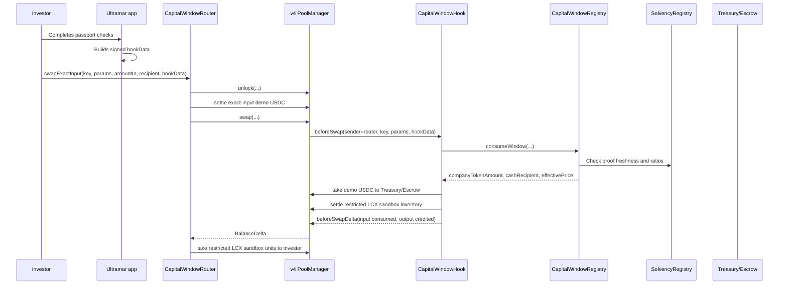

# Hookathon submission packet: Ultramar Port of Call

Working objective: convert the Port of Call use case into a crisp Hookathon submission that judges can understand, inspect, and remember.

Copy/paste submission fields live in `docs/HOOKATHON_SUBMISSION_FORM.md`.

Completion audit and final submission checklist live in `docs/HOOKATHON_COMPLETION_AUDIT.md`.

Judge fast path lives in `docs/HOOKATHON_JUDGE_FAST_PATH.md`.

Atrium course-to-demo alignment lives in `docs/HOOKATHON_ATRIUM_ALIGNMENT.md`.

Active Tally theme strategy lives in `docs/HOOKATHON_ACTIVE_THEME_STRATEGY.md`.

Web pitch deck source lives in `docs/HOOKATHON_SLIDE_DECK.md`.

Video recording kit lives in `docs/HOOKATHON_VIDEO_RECORDING_KIT.md`.

Exact Tally answers live in `docs/HOOKATHON_TALLY_SUBMISSION.md`.

Final Tally browser-session copy packet lives in `docs/HOOKATHON_TALLY_FINAL_PACKET.md`.

## Submission title

**Ultramar Port of Call: investment ports for local operating businesses**

## One-liner

An Abloh-inspired discovery app for private-market capital: investors travel to local businesses, see whether administration has created underwritable claims, get eligibility stamped, and choose an equity window, debt covenant preview, secondary transfer, or conversion route enforced by a Uniswap v4 hook.

## Thirty-second pitch

Private-market capital does not fail because investors lack appetite. It fails because cross-border trust is expensive: language, diligence, eligibility, legal limits, allocation, settlement, and reporting all live in different systems.

Ultramar Port of Call turns that into one v4-native flow. The app lets an eligible investor discover a local operating business, review translated diligence, see whether admin work has become underwriting evidence, receive a signed passport stamp, and choose the financing route the issuer can responsibly open. The current Solidity proof settles the restricted LCX sandbox equity window through custom accounting; the demo also previews a debt covenant route where stale coverage proof blocks access before any debt instrument becomes executable.

## Why this is v4-native

This is not an app that happens to call Uniswap. The hook is the product boundary.

- `beforeSwap` verifies route, investor, window, signature, cap, ticket size, deadline, nonce, token direction, and oracle freshness.
- `beforeSwapReturnDelta` uses custom accounting to replace generic AMM price discovery with a signed window settlement schedule.
- `beforeAddLiquidity` and `beforeRemoveLiquidity` block public LP behavior for the demo pool.
- The singleton `PoolManager` gives the demo an actual v4 settlement path instead of a standalone custom AMM.
- Flash-accounting deltas let the router settle exact input and take output without intermediate transfer noise.

## Abloh-inspired mapping

| Abloh-inspired pattern | Ultramar version | Demo expression |
| --- | --- | --- |
| Travel without leaving home | Explore capital "ports" around the world | Investor opens Mexico City and enters Lavanderias CX |
| Live translation | Translated diligence and operator Q&A | English investor reads Spanish-source KPI context |
| Local guide | Issuer/operator room | Store economics, use of funds, risks, and proof state |
| Administration becomes trust | Operating readiness map | Daily close, margin route, current asset coverage, and reporting freshness |
| Identity/profile | Investor passport | KYC/KYB, jurisdiction, NDA, allocation, transfer policy |
| Low-friction connection | Signed authorization | `hookData` carries window id, investor, min output, deadline, nonce, signature |
| Conversation becomes trust | Onchain capital route | Exact-input equity conversion succeeds only through the hook; debt access opens only with fresh covenant proof |

## Demo asset

Use **Lavanderias CX** because it is concrete, locally branded, and already modeled in the repo.

- Mexico City operating business.
- USD 560,000 expansion-round context.
- Use of funds: new-store capex, equipment, working capital, compliance/data room, contingency.
- Data-room state and missing-before-close blockers already exist.
- Oracle story is credible: accounting exports and store KPIs become freshness/solvency gates.

The demo must say **sandbox/testnet** and must not imply that LCX is currently available for public purchase.

## Two-minute demo script

1. **Problem**

   "Cross-border capital for small operating businesses breaks before settlement. Investors cannot understand the asset, issuers cannot prove readiness, and compliant transfer paths are not programmable."

2. **Discovery**

   Show the Port feed. Pick Mexico City. Open Lavanderias CX. The UI feels like travel: location, operator, proof state, translated highlights.

3. **Operating readiness**

   Show that administration creates market access: daily close becomes issuer proof, pickup and delivery density supports the equity route, current asset coverage supports the debt route, and reporting freshness controls hook access.

4. **Passport**

   Toggle or show completed checks: eligibility, NDA, allocation, transfer-policy acceptance, signed authorization. Explain that the passport becomes `hookData`.

5. **Capital route**

   Choose equity or debt. For equity, enter exact-input demo USDC and show expected restricted LCX sandbox output, cap remaining, per-investor limit, window timer, and oracle proof age. For debt, show current asset coverage and covenant freshness. The signed demo term should show how `4.5M USD` sandbox pre-money and `4.5M restricted LCX sandbox units` become `1.00 demo USDC/restricted LCX signed term`, with MXN economics translated through a signed FX snapshot before the restricted equity window opens.

6. **Execute**

   Execute through `CapitalWindowRouter`. The hook consumes the demo window, routes demo USDC to treasury or seller escrow, settles restricted LCX sandbox output, and emits reconciliation data. The contract tests now assert `WindowConsumed` and `CapitalWindowHookSwap` as the audit trail.

7. **Adversarial proof**

   Run a second attempt as an ineligible investor or with stale oracle data. It reverts. Close: "The hook is not decoration. It is the market boundary."

## Five-minute technical walkthrough

## Judging position

| Judge concern | Answer |
| --- | --- |
| Is this just a permissioned pool? | No. The hook replaces AMM execution with route-aware settlement: custom equity-window pricing, signed eligibility, caps, oracle freshness, covenant freshness, and window state. |
| Why use Uniswap v4 instead of a bespoke escrow contract? | v4 gives the standard pool interface, `PoolManager`, flash accounting, composable routing surface, and custom accounting. The hook specializes the market without rebuilding settlement from scratch. |
| Is it compliant? | It is compliance-aware, not a compliance claim. The demo blocks public purchase and models counsel-gated windows. Production needs counsel, transfer-agent/custody decisions, audit, and jurisdiction review. |
| Where is the economic value? | Issuers turn operating work into capital access; investors get legible diligence and deterministic execution; the protocol gets a new class of specialized, real-world markets. |
| Why will people remember it? | "Abloh for capital" is a simple mental model. The v4 hook becomes a passport checkpoint for local-business capital formation. |

## Prize category fit

Primary submission angle:

**Specialized Markets** - the official Tally form currently asks for UHI8 Specialized Markets. Port of Call creates asset-class-specific liquidity for private operating-business investment ports: route selection, eligibility, transfer policy, ticket size, timing, allocation caps, covenant coverage, oracle freshness, and router provenance are enforced by the hook instead of treated as offchain paperwork.

Secondary angles:

- **Yield-Protected AMM:** public LP deposits are blocked; issuer or escrow inventory is consumed only inside signed, capped, oracle-gated windows.
- **Fair Flow Frontier:** signed, exact-input, windowed order flow for private-market capital. Toxic public flow, generic routing, replayed authorizations, and unauthorized users are blocked.
- **Curated Liquidity:** future curators can bring vetted issuer windows and earn reputation based on window performance and reporting quality.

## Build plan

### P0: demo-day minimum

- Keep the existing `CapitalWindowRegistry`, `CapitalWindowHook`, and `CapitalWindowRouter` tests green.
- Add or expose a demo page that mirrors the script: port feed, operating readiness map, LCX room, passport status, quote, hook-state simulator, execute trace, audit trail. Current route: `/hookathon/port-of-call`.
- Add a judge-ready pitch deck route for the optional Tally deck field. Current route: `/hookathon/port-of-call/deck`; source outline: `docs/HOOKATHON_SLIDE_DECK.md`.
- Add one Foundry script or README section that shows the local demo sequence. Current script: `apps/private-equities/contracts/script/CapitalWindowDemo.s.sol`; current runbook: `apps/private-equities/contracts/README.md`.
- Record one success path and one revert path. Current tests assert hook permission encoding, router-bound passport digests, successful primary/secondary windows, audit events, missing-passport reverts, generic-router bypass rejection, expired authorization rejection, minimum-output slippage rejection, stale-oracle reverts, and replay reverts. The local demo script prints one approved settlement as raw test output (`1500.00` USDC -> `1454.54` LCX at `1.0312` USDC/LCX), representing `1,500 demo USDC` into `1,454.54 sandbox restricted LCX` at `1.0312 demo USDC/restricted LCX`, plus six blocked paths.
- Expose one-command local verification. Current command: `corepack yarn hookathon:check`.
- Expose one-command terminal proof for recording. Current command: `corepack yarn hookathon:video:proof`.
- Expose one-command captioned WebM review cut for upload/editing. Current command: `corepack yarn hookathon:render:video`.
- Expose one-command submission preflight. Current command: `corepack yarn hookathon:submission:preflight`.
- Expose production browser render QA for the public demo and deck. Current command: `corepack yarn hookathon:public:render:qa`.
- Expose strict final preflight after external URLs/details are filled. Current command: `corepack yarn hookathon:submission:preflight:strict`.
- Expose privacy hygiene verification for private submitter artifacts. Current command: `corepack yarn hookathon:privacy:check`.
- Expose live Tally field mapping. Current command: `corepack yarn hookathon:tally:field-map`.
- Expose live Tally browser QA. Current command: `corepack yarn hookathon:tally:live:qa`, which verifies that the official form renders and appears open.
- Expose live Tally fill planning. Current command: `corepack yarn hookathon:tally:fill-plan`.
- Expose a local Tally browser-session pack for the final copy/paste pass. Current command: `corepack yarn hookathon:tally:session`, which writes ignored Markdown/HTML aids under `artifacts/hookathon/`.
- Expose visual QA for the local Tally browser-session pack. Current command: `corepack yarn hookathon:tally:session:qa`, which writes ignored desktop/mobile screenshots and a QA report under `artifacts/hookathon/`.
- Expose one final submit operator pass. Current command: `corepack yarn hookathon:submission:operator`, with `--strict` requiring personal inputs from shell env or ignored `artifacts/hookathon/final-submit.env` and a submit-ready browser session pack.
- Expose a final private handoff sheet. Current command: `corepack yarn hookathon:submission:handoff`, which writes ignored `artifacts/hookathon/final-handoff-latest.md` without personal values.
- Expose private Tally personalization without committing personal data. Current command: `corepack yarn hookathon:tally:personalize` with `HOOKATHON_SUBMITTER_EMAIL`, `HOOKATHON_WORKED_WITH_TEAM`, `HOOKATHON_COURSE_RATING`, and `HOOKATHON_TEAM_DETAILS` if team status is `Yes`.
- Expose private post-submit receipt capture without committing personal data. Current command: `corepack yarn hookathon:submission:receipt` with `HOOKATHON_TALLY_SUBMITTED_AT`, `HOOKATHON_TALLY_CONFIRMATION`, optional `HOOKATHON_TALLY_EVIDENCE`, and optional `HOOKATHON_SUBMITTER_EMAIL`.
- Expose one-command v4 testnet simulation. Current command: `corepack yarn hookathon:testnet:e2e`.
- Keep every user-facing statement clearly sandbox/testnet and non-offer.

### P1: stronger technical signal

- Add an event indexing mock that maps `CapitalWindowHookSwap` and `WindowConsumed` into CRM/portfolio rows. The event pair is asserted in `CapitalWindowHook.t.sol`, and `/hookathon/port-of-call` now renders the mock indexer output.
- Add a hook-address permission verification script. The current suite covers this with `testHookAddressEncodesOnlyCapitalWindowPermissions`.
- Add a direct PoolManager/generic route bypass test if not already covered by the exact current suite. The current suite now covers signed-passport bypass rejection through `testGenericRouterWithCapitalPassportReverts`.
- Add stale-oracle and used-nonce states to the frontend demo controls. The current demo now exposes Approved, Missing passport, Replay, Stale oracle, and Generic router states, mapped to the corresponding Foundry tests.

### P2: post-Hookathon moat

- Testnet deployment on Base Sepolia or Sepolia using official v4 deployments.
- Generated investor passport signature from the app backend.
- Operator update room with translated issuer Q&A.
- Curator/reputation layer for vetted local-business windows.

## Non-negotiable boundaries

- No real funds.
- No public purchase language.
- No wire instructions.
- No binding commitments.
- No claim that the hook itself creates legal compliance.
- No automatic repricing from raw accounting data.

## Current evidence in repo

- Use case thesis: `docs/HOOKATHON_USECASE_ULTRAMAR_PORT_OF_CALL.md`
- Submission form copy: `docs/HOOKATHON_SUBMISSION_FORM.md`
- Exact Tally answers: `docs/HOOKATHON_TALLY_SUBMISSION.md`
- Final Tally copy packet: `docs/HOOKATHON_TALLY_FINAL_PACKET.md`
- Completion audit: `docs/HOOKATHON_COMPLETION_AUDIT.md`
- Judge fast path: `docs/HOOKATHON_JUDGE_FAST_PATH.md`
- Atrium course alignment: `docs/HOOKATHON_ATRIUM_ALIGNMENT.md`
- Active Tally theme strategy: `docs/HOOKATHON_ACTIVE_THEME_STRATEGY.md`
- Web pitch deck source: `docs/HOOKATHON_SLIDE_DECK.md`
- Demo run-of-show: `docs/HOOKATHON_DEMO_RUN_OF_SHOW.md`
- Video recording kit: `docs/HOOKATHON_VIDEO_RECORDING_KIT.md`
- Demo surface: `apps/ultramar/app/hookathon/port-of-call/page.tsx`
- Pitch deck surface: `apps/ultramar/app/hookathon/port-of-call/deck/page.tsx`
- Hook-state simulator: `apps/ultramar/components/hookathon-scenario-simulator.tsx`
- v4 architecture: `docs/UNISWAP_V4_PERMISSIONED_LIQUIDITY_ARCHITECTURE.md`
- LCX capital-readiness context: `docs/LAVANDERIAS_CX_CAPITAL_RAISE_READINESS.md`
- Contracts: `apps/private-equities/contracts/src/CapitalWindow*.sol`
- Local demo script: `apps/private-equities/contracts/script/CapitalWindowDemo.s.sol`
- Optional testnet deploy script: `apps/private-equities/contracts/script/DeployCapitalWindowTestnet.s.sol`
- Optional testnet swap script: `apps/private-equities/contracts/script/ExecuteCapitalWindowTestnetSwap.s.sol`
- Captioned video render script: `scripts/hookathon-render-video.mjs`
- Public link check script: `scripts/hookathon-public-links-check.mjs`
- Public render QA script: `scripts/hookathon-public-render-qa.mjs`
- Privacy hygiene script: `scripts/hookathon-privacy-check.mjs`
- Final submit operator script: `scripts/hookathon-final-submit-run.mjs`
- Final handoff script: `scripts/hookathon-submission-handoff.mjs`
- Tally field map script: `scripts/hookathon-tally-field-map.mjs`
- Tally live QA script: `scripts/hookathon-tally-live-qa.mjs`
- Tally fill plan script: `scripts/hookathon-tally-fill-plan.mjs`
- Tally browser session script: `scripts/hookathon-tally-session-pack.mjs`
- Tally browser session QA script: `scripts/hookathon-tally-session-qa.mjs`
- Submission readiness script: `scripts/hookathon-readiness-report.mjs`
- Private Tally personalization script: `scripts/hookathon-personalize-tally.mjs`
- Private Tally receipt script: `scripts/hookathon-submission-receipt.mjs`
- Submission preflight script: `scripts/hookathon-submission-preflight.mjs`
- Tests: `apps/private-equities/contracts/test/CapitalWindowHook.t.sol`
- Demo runbook: `apps/private-equities/contracts/README.md`
- Testnet deployment runbook: `docs/HOOKATHON_TESTNET_DEPLOYMENT.md`
- Public technical article: `apps/ultramar/lib/press.ts`

## Source basis

- Uniswap v4 whitepaper: hooks, singleton, flash accounting, and custom accounting.
- Uniswap v4 docs: hooks, PoolManager, dynamic fees, flash accounting, and custom accounting.
- Atrium course outline: capstone projects should design custom hooks with real value and present to investors/researchers.
- Atrium 2026 roadmap: specialized markets, yield-protected AMMs, fair flow/MEV protection, and curated liquidity.
