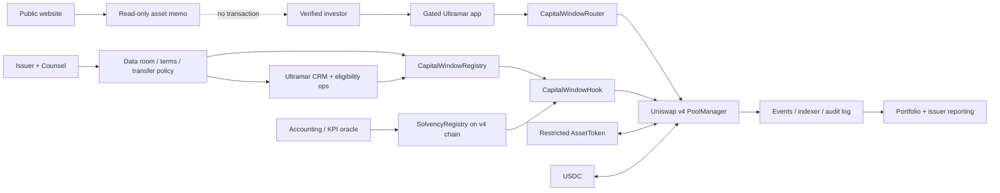

# Uniswap v4 permissioned liquidity architecture

Working objective: evaluate whether Ultramar Private Equities can use Uniswap v4 as the gated conversion substrate for approved capital windows while preserving the prior counsel-gated boundary: no public purchase, subscription, swap, wire instruction, or binding commitment until the issuer path is approved.

This is architecture guidance, not legal, tax, accounting, or investment advice. Counsel must approve the issuer, investor jurisdictions, transfer restrictions, marketing language, liquidity operations, custody, and funds flow before any production pool or transaction path is exposed.

## Current conclusion

Uniswap v4 is viable only as a controlled capital-window infrastructure layer, not as a public trading shortcut.

The right direction is:

- Keep Ultramar public pages read-only and informational.
- Keep public primary issuance, public allocation, subscription, and funds-flow instructions outside Ultramar public pages.
- Use Uniswap v4 only as the final gated conversion step after eligibility, allocation, counsel review, and signed authorization exist.
- Replace `SimpleAMM` as the long-term liquidity primitive with Capital Windows: scheduled primary conversion windows and company-sponsored secondary windows.
- Enforce eligibility and transfer controls through both the restricted `AssetToken` and a Uniswap v4 Hook.
- Use an Ultramar-controlled router/gated app path; reject generic public routes unless they carry approved eligibility context.
- Use custom accounting for the hackathon demo to replace generic AMM price discovery with fixed signed window terms, plus optional disclosed tranche steps when the term sheet requires them.

## Official v4 premises

Links rechecked on May 13, 2026:

- Uniswap v4 uses hooks, singleton `PoolManager`, flash accounting, dynamic fees, native ETH support, and custom accounting: https://developers.uniswap.org/docs/protocols/v4/concepts/architecture
- `PoolManager` is the single entry point for pools; swaps call `beforeSwap` and `afterSwap` hooks when configured: https://developers.uniswap.org/docs/protocols/v4/concepts/poolmanager
- Flash accounting nets balance deltas and requires callers to resolve outstanding balances before control returns to `PoolManager`: https://developers.uniswap.org/docs/protocols/v4/concepts/flash-accounting
- Hook permissions are encoded in the hook contract address; production deployment needs address mining and permission verification: https://developers.uniswap.org/docs/protocols/v4/guides/hooks/hook-deployment
- Uniswap v4 deployments are chain-specific. Do not assume the same addresses across chains: https://developers.uniswap.org/docs/protocols/v4/deployments
- Uniswap's hook security framework treats hooks as a new risk surface requiring scoring, testing, monitoring, and audit planning: https://developers.uniswap.org/docs/protocols/v4/security

## Implementation status

Implemented locally on May 28, 2026 in `apps/private-equities/contracts`:

- `CapitalWindowRegistry`: schedules primary and secondary windows with caps, investor limits, signed authorization, and oracle freshness checks.
- `CapitalWindowHook`: uses `beforeSwap` plus `beforeSwapReturnDelta` custom accounting to replace generic AMM execution with a signed window settlement schedule.
- `CapitalWindowRouter`: pre-settles exact-input investor payment into `PoolManager`, routes through the hook, and delivers company-token output to the approved recipient.
- `CapitalWindowHook.t.sol`: tests hook-address permission encoding, router-bound passport digests, primary conversion, secondary liquidity, audit-trail event emission, missing-passport rejection, generic-router bypass rejection, expired authorization rejection, authorization replay rejection, minimum-output slippage rejection, outside-window rejection, total-cap rejection, per-investor-cap rejection, stale oracle rejection, unapproved investor rejection, invalid signature rejection, exact-output rejection, and unauthorized liquidity modification rejection.

This implementation is a hackathon demo and architecture proof. It is not audited, deployed, or available as production liquidity.

## Chain decision

The current private-equities contracts reference Mantle Sepolia. Official Uniswap v4 deployments are listed for networks such as Ethereum, Base, Arbitrum, Polygon, Unichain, and their supported testnets, but not Mantle in the checked deployment list.

Recommended path:

1. Keep Mantle Sepolia for the existing `SolvencyRegistry` demo until replaced.
2. Prototype the v4 integration on Base Sepolia or Sepolia because official v4 testnet deployments exist there.
3. For production, choose a chain only after counsel, custody, liquidity, investor geography, and issuer reporting requirements are decided.
4. Avoid a cross-chain hook that depends directly on Mantle oracle state. Instead, publish signed oracle proofs onto the target v4 chain or have the hook consume a local `SolvencyRegistry` mirror.

## High-level architecture

## Component map

### Public product shell

- `apps/ultramar` remains the canonical public site.
- `/private-equities/assets/lcx` explains the round, target raise, data room state, risks, and missing-before-close blockers.
- `/private-equities/market` must stay read-only until the approved gated workflow exists.
- Public pages never deep-link directly into a Uniswap transaction path.

### Gated Ultramar app

- Handles authentication, KYC/KYB status, investor category, jurisdiction, sanctions checks, NDA status, suitability, and transfer-policy acceptance.
- Shows capital-window quotes and state only to eligible investors.
- Builds transaction calldata for `CapitalWindowRouter`.
- Passes signed authorization context to the v4 Hook through `hookData`: window id, investor, minimum company-token output, deadline, nonce, and authorizer signature.

### `AssetToken`

- Remains a restricted ERC20 representing the private-market interest.
- Separates holder eligibility from transfer authority.
- Approved investors may be eligible to receive and hold the token, but their wallets should not be allowed to initiate unrestricted peer-to-peer transfers.
- Non-mint and non-burn transfers should require an approved transfer agent path, for example:
  - `UltramarV4Router`,
  - approved custody or settlement contracts,
  - issuer/admin-controlled transfer-agent wallets,
  - `PoolManager` only when reached through the approved router and Hook flow.
- The token should consult `EligibilityRegistry` and `TransferPolicyRegistry` before allowing any transfer, even if both `from` and `to` are otherwise approved holders.
- Required infrastructure contracts such as `PoolManager` and `PositionManager` should receive narrowly scoped permissions, not blanket holder-equivalent freedom.
- Token restrictions are the last line of defense if a route bypasses the app or Hook; direct holder-to-holder transfers must fail unless a counsel-approved transfer policy explicitly permits that path.

### Capital Windows

Capital Windows are the v4 primitive for the hackathon implementation. They are scheduled, counsel-gated windows that can operate in two modes:

- `PrimaryConversion`: an approved investor uses USDC to receive company tokens from issuer-controlled inventory after allocation and authorization.
- `SecondaryLiquidity`: a company-sponsored transfer window lets approved buyers receive company tokens from escrow while cash routes to a seller or settlement recipient.

Each window defines start/end time, payment token, company token, cash recipient, total cap, per-investor cap, min/max ticket, base conversion price, optional step increments, oracle freshness, and active/paused/closed status.

The v1 pricing policy is fixed-first. The approved round or window terms set the base price for the active window. Optional step increments are used only when the signed terms disclose scheduled tranches; in that case the hook splits exact input across those price shelves. Oracle data gates availability and freshness; it does not silently reprice the asset.

### `CapitalWindowHook`

The hackathon hook is intentionally restrictive even though it uses custom accounting.

Recommended callback permissions:

- `beforeAddLiquidity`: reject public liquidity modification for the custom-accounting pool.
- `beforeRemoveLiquidity`: reject public liquidity modification for the custom-accounting pool.
- `beforeSwap`: require exact input, approved router, valid `hookData`, active window, eligible investor, signed authorization, caps, oracle freshness, and valid token direction.
- `beforeSwapReturnDelta`: consume the full exact input and return custom company-token output from the window curve.

Avoid in production until separately reviewed:

- automatic fee changes,
- cross-chain state reads inside swap execution.
- generic Universal Router paths.
- unsupported exact-output swaps.

### `CapitalWindowRouter`

This is the transaction adapter between the gated app and Uniswap v4.

Responsibilities:

- Pre-settle the investor payment into `PoolManager`, call the window hook, and deliver company tokens to the approved recipient.
- Route only exact-input payment-token-to-company-token conversions.
- Restrict calls to known pool keys and approved tokens.
- Prevent generic Universal Router paths from becoming the primary compliance surface.
- Emit app-level events that match CRM stages and portfolio reporting.

### Oracle and reporting

- `SolvencyRegistry` stays separate from the pool.
- The Hook should not price trades from raw accounting data.
- The Hook may use coarse status flags, for example `oracleHealthy`, `proofFresh`, `tradingPaused`, or `issuerDefaultFlag`.
- Detailed issuer data remains private in the data room and investor reporting workflow.

## Lifecycle

### Phase 0: counsel-gated design

- No v4 pool deployed for LCX.
- Public UI remains informational.
- Counsel approves whether secondary liquidity is allowed, under what exemption/path, and who may hold or trade.

### Phase 1: v4 sandbox

- Deploy mock `AssetToken`, local `SolvencyRegistry`, `CapitalWindowRegistry`, `CapitalWindowHook`, and `CapitalWindowRouter` on Base Sepolia or Sepolia.
- Initialize a test LCX/USDC v4 pool with the mined hook address.
- Test primary conversion, secondary windows, direct PoolManager/router attempts, ineligible investor attempts, expired windows, stale oracle proofs, cap breaches, exact-output rejection, and liquidity modification rejection.

### Phase 2: private pilot

- Use production-like KYC/KYB data but non-production capital.
- Run full event indexing, CRM reconciliation, oracle freshness checks, and incident procedures.
- Complete hook security scoring, audit, invariant tests, fuzz tests, and monitoring.

### Phase 3: approved secondary liquidity

- Deploy production contracts only after legal, security, custody, and issuer approvals.
- Open the gated transaction path only to eligible investors.
- Keep public pages as read-only memos with no transaction controls.

## Security and compliance risks

- Public pool discoverability: even a blocked pool may signal a securities market. Do not initialize production pools before counsel approval.
- Route bypass: assume users and aggregators may call v4 directly. The Hook and `AssetToken` must reject unauthorized flows.
- Router ambiguity: `sender` may be the router, not the final investor. The architecture must verify end-beneficiary data through signed hook payloads and app-side routing.
- Router-bound passports: authorization digests must include the approved router address so a valid signature for `CapitalWindowRouter` cannot be replayed through generic v4 routing.
- Hook permission mistakes: because callback permissions are encoded in the deployed address, deployment scripts must verify the permission bitmap.
- Flash-accounting assumptions: hook logic must not rely on stale transient deltas or unresolved balances.
- Token-transfer edge cases: restricted ERC20 behavior must be tested with `PoolManager`, periphery contracts, LP mint/burn, swaps, refunds, and pauses.
- Oracle misuse: accounting proofs should gate status, not silently change pricing.
- Liquidity optics: a v4 pool can look like public market availability; marketing copy must stay counsel-reviewed.

## Migration from current `SimpleAMM`

`SimpleAMM` should become a local test harness and conceptual prototype, not the production liquidity layer.

Migration target:

- Keep `SimpleAMM` tests for simple transfer-restriction proofs.
- Add a new v4 integration workspace under contracts once implementation begins.
- Port the relevant tests:
  - whitelisted investor can convert through the approved route,
  - scheduled primary conversion window routes cash to treasury,
  - scheduled secondary window routes cash to seller escrow,
  - non-whitelisted or unauthorized investor reverts,
  - stale oracle proof reverts,
  - over-cap and over-investor-cap attempts revert,
  - exact-output attempts revert,
  - public add/remove liquidity reverts,
  - event stream reconciles against CRM/portfolio state.

## Open decisions

- Production chain: Base, Arbitrum, Ethereum, Unichain, or another officially supported v4 deployment.
- Token standard: keep restricted ERC20 or migrate to a more securities-specific transfer-control standard.
- Router policy: Ultramar-only router versus allowing approved Universal Router flows with strict hook data.
- LP model: hook-owned company-token inventory for capital windows versus separate issuer-only liquidity after legal review.
- Fee policy: fixed v4 fee tier in v1; dynamic fees only after separate review.
- Oracle gating: which oracle status flags can pause or restrict transfers.
- Custody: self-custody, qualified custody, or broker/custodian-mediated wallets.

## Definition of architecture-ready

The v4 route is architecture-ready when:

- Counsel approves that a secondary liquidity design is permissible for the target investor base.
- The public product remains read-only and cannot initiate transactions.
- The selected chain has confirmed Uniswap v4 deployments for `PoolManager`, periphery, Universal Router, Permit2, Quoter, and StateView.
- The Hook design uses minimal callback permissions and has a verified mined address.
- The restricted token and Hook independently reject unauthorized transfers.
- The gated app, router, CRM, KYC/KYB, oracle status, and portfolio reporting all reconcile from the same investor and pool event model.
- Security review includes hook risk scoring, audits, fuzz/invariant testing, monitoring, and incident procedures.
